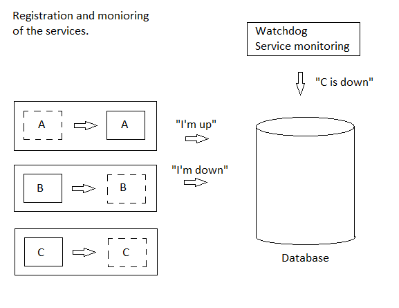

# delivery-service-csharp 

[English](README.md) | [Русский](README.ru.md)

A **delivery service app** is an ERP platform that enables users to order and receive goods. 
The app includes features such as browsing products, selecting delivery options, tracking orders in real-time, and making payments.

## Overall description 

### Goal 

The goals of the delivery service app in general are to provide a convenient and efficient way for customers to order and receive deliveries, while also streamlining the process for businesses and couriers involved in the delivery process.

The goals of the project are to develop a comprehensive delivery service app that meets the needs of all stakeholders involved in the delivery process, including customers, businesses, couriers, and managers. 
This includes developing client side apps for each user type, as well as backend services to support authentication, files, statistics, prediction, email sending, and push notifications.

### Scope 

The scope of the project includes developing a full-stack delivery service app that can handle all aspects of the delivery process, from customer orders to courier deliveries. 
This includes developing client side apps for six different user types, as well as backend services to support authentication, files, statistics, prediction, email sending, and push notifications.

### Who can use this app 

The application is designed to be used by customers, businesses, couriers, and managers involved in the delivery process. 
Any company that offers delivery services could potentially use this application, including restaurants, grocery stores, retail stores, and other businesses that offer delivery services.

## System requirements and description

### System description

- Types of client applications by end user type: 
    - [customers](docs/frontend/customerclient.md), 
    - [kitchen](docs/frontend/kitchenclient.md), 
    - [warehouse](docs/frontend/warehouseclient..md), 
    - [couriers](docs/frontend/courierclient.md), 
    - [managers](docs/frontend/managerclient.md), 
    - [HR](docs/frontend/hrclient.md), 
    - [financial managers](docs/frontend/financialclient.md), 
    - [marketing](docs/frontend/marketingclient.md), 
    - [lawyer](docs/frontend/lawyerclient.md), 
    - [admins](docs/frontend/adminclient.md), 
    - [DBA](docs/frontend/dbaclient.ru.md), 
    - [developer](docs/frontend/developerclient.md), 
    - [QA engineer](docs/frontend/qaengineerclient.md), 
    - [tech support](docs/frontend/techsupportclient.md).
- Types of client applications by deployment type: web, desktop, mobile (Xamarin, Android), telegram bot.
- Description of backend services: 
    - [authentication API](docs/backend/authbackend.md), 
    - [customer backend](docs/backend/customerbackend.md), 
    - [kitchen backend](docs/backend/kitchenbackend.md), 
    - [warehouse backend](docs/backend/warehousebackend.md), 
    - [courier backend](docs/backend/courierbackend.md), 
    - [manager backend](docs/backend/managerbackend.md), 
    - [HR backend](docs/backend/hrbackend.md), 
    - [financial backend](docs/backend/financialbackend.md), 
    - [marketing backend](docs/backend/marketingbackend.md), 
    - [lawyer backend](docs/backend/lawyerbackend.md), 
    - [admin backend](docs/backend/adminbackend.md), 
    - [DBA backend](docs/backend/dbabackend.md), 
    - [developer backend](docs/backend/developerbackend.md), 
    - [QA engineer backend](docs/backend/qaengineerbackend.md), 
    - [tech support backend](docs/backend/techsupportbackend.md), 
    - [system backend](docs/backend/systembackend.md), 
    - [file service](docs/backend/fileservice.md), 
    - [statistical backend](docs/backend/statisticalbackend.md), 
    - [predictive backend](docs/backend/predictivebackend.md), 
    - [notifications](docs/backend/notificationsbackend.md).
- Description of process patterns (you can read more about process patterns at [this link](docs/processpatterns/README.md)): 
    - [information](docs/processpatterns/information.md),
    - [maintenance](docs/processpatterns/maintenance.md),
    - [transmitting file](docs/processpatterns/transmittingfile.md),
    - [requesting](docs/processpatterns/requesting.md).
- Description of process patterns (see also: [flowchart steps](docs/flowchartsteps/README.md)): 
    - [delivering](docs/flowchartsteps/delivering/README.md).
- Types of payment: 
    - cash upon receipt, 
    - through a validator upon receipt, 
    - through the bank's application using a QR code, 
    - in the application using CVC.
- Upload files to the server (images, videos, Word, Excel, PDF).
- Download files from the server (images, Word, Excel, PDF).
- Sending notifications about promotions via email and/or Telegram.
<!--
- Generation of a QR code for payment.
- Displaying information on orders in the form of lists: a list of all orders, information on a specific order (actual time of registration, cooking and delivery; estimated time of cooking and delivery, total order amount, cost of order items, delivery place; status).
- Statistics on many orders in the form of dashboards (by time: day, week, month, year, all time; by type of charts: Line chart, Bar chart, Histogram, Scatter plot, etc.; metrics: total order amount, cost positions, number of orders, number of positions, time of ordering, place of delivery).
- Metrics for internal use: the actual time of ordering, cooking and delivery; the total amount of the order, the value of the order items, the number of orders, the number of items, the time of ordering, the place of delivery, the place of user registration.
- Predictive models for all metrics: for a group of users (filter: city, country, age, gender, matches in users' full name, place of delivery, place of registration; display: list of users, brief information about the user).
- Tracking the location of the courier.
-->

### Technical requirements for the system

- Distributed system for storing records in the database: make an analysis of the database, which is optimal for writing and reading.
- Several storage types: SQL, sessions, file storage.
- Load balancing - Load balancer.
- Web (ASP.NET Core MVC + React), desktop (WPF), [Telegram.Bot](https://github.com/TelegramBots/Telegram.Bot).
- Using gRPC, RabbitMQ, ElasticSearch, WebAPI and worker.
- RabbitMQ can have multiple "subscribers".
- Asynchronous and multithreading programming (for example, when forming images).
- External services: 
    - [workflow-auth](https://github.com/alexeysp11/workflow-auth), 
    - [workflow-lib](https://github.com/alexeysp11/workflow-lib)
    <!--, Firebase, email delivery service, payment gateway.-->

### General system model

This diagram displays a list of client applications, backend services and databases, as well as the general principle of interaction between them.

The diagram notes that the admin backend service is infrastructural and has access to all backend services and databases within the platform, so all the functionality that is necessary for all IT specialists basically goes through the admin backend service.

The principle of naming modules is also indicated.


### Simplified diagram of the layers 

The diagram below shows the principle of layering within the platform.


### Diagram of interaction between application layers

There's also the diagram that demonstrates in more detail the principle on which the dynamism of the platform is based in the context of choosing the type of client application (MVC, Blazor, WPF etc) and the data transfer protocol between backend services (WebAPI, gRPC).


The diagrams show separate databases for different services; in fact, the database can be either common to all services or separate (however, due to replication, all services must work with data as if it were the same database, i.e. i.e. have identical tables and records in them).

To achieve platform flexibility, controllers should be empty: it is desirable that all data processing logic be located in BL modules.
Thus, the client application can be completely different (ASP.NET MVC, Blazor, WPF, React.js etc), i.e. it becomes responsible only for displaying data on the UI.
For client applications, communication with the database is allowed only for working with the cache.

The client application communicates with its backend service exclusively directly and in most cases over the HTTP protocol.

Microservices can communicate with each other either directly or through a data bus.
The data bus is implemented in two possible ways:
- a common web service for backend and system services (a kind of proxy);
- use of message brokers (for example, RabbitMQ).

### Service discovery 

Details of communication between microservices:
- if service A **knows** which service to contact:
     - service A contacts the resolver to send a request to service B;
     - the resolver accesses the database to determine the method of interaction, based on this it calls the corresponding class from the library [workflow-lib](https://github.com/alexeysp11/workflow-lib) for communication (directly via HTTP, directly via gRPC, HTTP proxy, gRPC proxy, RabbitMQ etc);
     - in the case of any communication via HTTP or gRPC, the calling module simply waits for the response and gives it to the module that initiated the communication and called the resolver;
     - in the case of communication via a message broker, we simply send the status of whether the message is recorded in the queue.
- if service A **doesn’t know** which service to contact:
     - service A contacts the resolver to send a request to the next module;
     - the resolver accesses the database to determine the next module and how to interact with it;
     - after this, all interaction between services is carried out in the same way as in the previous option.

The above methods of interservice communication would allow very flexible configuration of communication between microservices through configs or databases.
The corresponding classes for configuring inter-service communication can be found in the namespace [Cims.WorkflowLib.Models.Network.MicroserviceConfigurations](https://github.com/alexeysp11/workflow-lib/tree/main/src/Models/Network/MicroserviceConfigurations).

Positive consequences of implementing this approach:
- Simplification of configuration and updating of components without the need to rebuild the code.
- The ability to choose the most appropriate method of interaction for each specific task.
- Flexibility to change connections and configurations of components without changing the code.
- Centralized storage of information about connections and configurations for convenient management.
- Ability to dynamically change connections and configurations without restarting components.
- Increased flexibility and adaptability of the system thanks to dynamic connection management.
- Improved scalability due to the ability to add new components without changing the code.
- Reducing dependencies between microservices, which increases their independence and simplifies development and testing.
- Simplification of system scaling, since each microservice can be scaled independently of others.
- Improved testing with the ability to easily change configurations to test different scenarios.

Negative consequences of implementing this approach:
- Increasing complexity of the system due to the need to support several methods of interaction and their combinations.
- Potential increase in database load due to storage of configuration and communication data.
- Potential performance issues due to additional database queries to retrieve configurations.
- Increased network load due to the use of different network protocols.
- The risk of dependencies between components due to implicit communication through the database.
- Risk of problems with fault tolerance due to a centralized point of failure - the database.
- Potential scaling issues due to database performance limitations when dealing with a large number of queries.
- Complication of debugging and monitoring of the system on the production server.

Ways to improve the approach:
- Implementation of a mechanism for caching query results to improve performance.
- Implementation of a fallback mechanism to handle failures in communication between components.
- Development of monitoring to track the performance and condition of components.
- Expanded configuration options via a web interface for ease of administration.
- Implementation of a mechanism for automatically scaling components when the load changes.
- Development of a logging system to track and analyze requests and responses.
- Implementation of a mechanism for updating the configuration of components without restarting the entire system.
- Implementation of an error and exception handling mechanism to improve system reliability.
- Development of a testing system to check the functionality and compliance of business logic.
- Implementation of an automatic data backup mechanism to ensure security.

### Registration and monitoring of the services



## Project configuration

To download this project and all its dependencies, you must sequentially execute the following commands on the command line:
```
git clone https://github.com/alexeysp11/Open-Xml-PowerTools.git 
git clone https://github.com/alexeysp11/workflow-lib.git
git clone https://github.com/alexeysp11/workflow-auth.git
git clone https://github.com/alexeysp11/delivery-service-csharp.git
```

## Docs

- [Versions of the project](docs/versions.md)
- [TODO](docs/TODO.md)
- [Contributing to projects](https://docs.github.com/en/get-started/quickstart/contributing-to-projects)
- [GitHub flow](https://docs.github.com/en/get-started/quickstart/github-flow)
