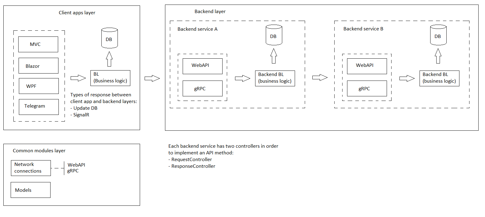

# delivery-service-csharp 

Read this in other languages: [English](README.md), [Russian/Русский](README.ru.md). 

## System requirements and description

### System description

- Highly loaded system: each element of the system must be able to withstand a load of up to 5 thousand requests per second for writing and reading.
- Types of client applications by end user type: for [consumers](docs/frontend/customerclient.md), [kitchen](docs/frontend/kitchenclient.md), [warehouse](docs/frontend/warehouseclient..md), [couriers](docs/frontend/courierclient.md), [managers](docs/frontend/managerclient.md), [admins](docs/frontend/adminclient.md).
- Types of client applications by deployment type: web, desktop, mobile (Android), telegram bot.
- Description of backend services: [authentication API](docs/backend/authbackend.md), [customer backend](docs/backend/customerbackend.md), [kitchen backend](docs/backend/kitchenbackend.md), [courier backend](docs/backend/courierbackend.md), [manager backend](docs/backend/managerbackend.md), [file service](docs/backend/fileservice.md), [statistical model](docs/backend/statisticalmodel.md), [predictive model](docs/backend/predictivemodel.md), [email sender](docs/backend/emailsender.md), [ push notifications](docs/backend/pushnotifications.md).
- External services: [workflow-auth](https://github.com/alexeysp11/workflow-auth), [workflow-lib](https://github.com/alexeysp11/workflow-lib), Firebase, email delivery service, payment gateway.
- Types of payment: cash upon receipt, through a validator upon receipt, through the bank's application using a QR code, in the application using CVC.
- Upload files to the server (images, videos, Word, Excel, PDF).
- Download files from the server (images, Word, Excel, PDF).
- Generation of a QR code for payment.
- Sending notifications about promotions to email and / or telegrams.
- Displaying information on orders in the form of lists: a list of all orders, information on a specific order (actual time of registration, cooking and delivery; estimated time of cooking and delivery, total order amount, cost of order items, delivery place; status).
- Statistics on many orders in the form of dashboards (by time: day, week, month, year, all time; by type of charts: Line chart, Bar chart, Histogram, Scatter plot, etc.; metrics: total order amount, cost positions, number of orders, number of positions, time of ordering, place of delivery).
- Metrics for internal use: the actual time of ordering, cooking and delivery; the total amount of the order, the value of the order items, the number of orders, the number of items, the time of ordering, the place of delivery, the place of user registration.
- Predictive models for all metrics: for a group of users (filter: city, country, age, gender, matches in users' full name, place of delivery, place of registration; display: list of users, brief information about the user).
- Tracking the location of the courier.

### Technical requirements for the system

- Distributed system for storing records in the database: make an analysis of the database, which is optimal for writing and reading.
- Several storage types: SQL, sessions, file storage.
- Load balancing - Load balancer.
- Web (ASP.NET Core MVC + React), desktop (WPF).
- Using gRPC, RabbitMQ, ElasticSearch, WebAPI and worker.
- RabbitMQ can have multiple "subscribers".
- Asynchronous and multithreading programming (for example, when forming images).

### General system model


### Simplified diagram of the layers 



## Project configuration

To download this project and all its dependencies, you must sequentially execute the following commands on the command line:
```
git clone https://github.com/alexeysp11/Open-Xml-PowerTools.git 
git clone https://github.com/alexeysp11/workflow-lib.git
git clone https://github.com/alexeysp11/workflow-auth.git
git clone https://github.com/alexeysp11/delivery-service-csharp.git
```
