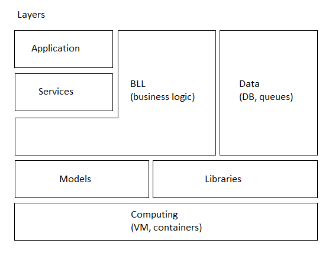

# delivery-service-csharp 

[English](README.md) | [Русский](README.ru.md)

**Приложение сервиса доставки** — это ERP платформа, которая позволяет пользователям заказывать и получать продукты.
Приложение включает в себя такие функции, как просмотр продуктов, выбор вариантов доставки, отслеживание заказов в режиме реального времени и осуществление платежей.

## Общее описание

### Цель

Целью приложения службы доставки в целом является предоставление клиентам удобного и эффективного способа заказа и получения доставки, а также оптимизация процесса для предприятий и курьеров, участвующих в процессе доставки.

Цели проекта — разработать комплексное приложение для службы доставки, отвечающее потребностям всех заинтересованных сторон, участвующих в процессе доставки, включая клиентов, предприятия, курьеров и менеджеров.
Это включает в себя разработку клиентских приложений для каждого типа пользователей, а также серверных служб для поддержки аутентификации, файлов, статистики, прогнозирования, отправки электронной почты и push-уведомлений.

### Область применения

В область применения проекта входит разработка полнофункционального приложения для службы доставки, которое может обрабатывать все аспекты процесса доставки: от заказов клиентов до курьерских доставок. 
Сюда входит разработка клиентских приложений для шести различных типов пользователей, а также серверных служб для поддержки аутентификации, файлов, статистики, прогнозирования, отправки электронной почты и push-уведомлений.

### Кто может использовать это приложение

Приложение предназначено для использования клиентами, предприятиями, курьерами и менеджерами, участвующими в процессе доставки.
Любая компания, предлагающая услуги доставки, потенциально может использовать это приложение, включая рестораны, продуктовые магазины, розничные магазины и другие предприятия, предлагающие услуги доставки.

## Требования к системе и её описание 

### Описание системы

- Виды клиентских приложений по типу конечного пользователя: 
    - [потребителей](docs/frontend/customerclient.ru.md), 
    - [кухни](docs/frontend/kitchenclient.ru.md), 
    - [склада](docs/frontend/warehouseclient.ru.md), 
    - [курьеров](docs/frontend/courierclient.ru.md), 
    - [менеджеров](docs/frontend/managerclient.ru.md), 
    - [HR](docs/frontend/hrclient.ru.md), 
    - [финансовых менеджеров](docs/frontend/financialclient.ru.md), 
    - [маркетинг](docs/frontend/marketingclient.ru.md), 
    - [юрист](docs/frontend/lawyerclient.ru.md), 
    - [админов](docs/frontend/adminclient.ru.md), 
    - [DBA](docs/frontend/dbaclient.ru.md), 
    - [разработчик](docs/frontend/developerclient.ru.md),
    - [QA-инженер](docs/frontend/qaengineerclient.ru.md),
    - [техническая поддержка](docs/frontend/techsupportclient.ru.md).
- Виды клиентских приложений по типу развертывания: вэб, десктоп, мобильное (Xamarin, Android), бот в телеграм.
- Описание бэкенд сервисов: 
    - [authentication API](docs/backend/authbackend.ru.md), 
    - [customer backend](docs/backend/customerbackend.ru.md), 
    - [kitchen backend](docs/backend/kitchenbackend.ru.md), 
    - [warehouse backend](docs/backend/warehousebackend.ru.md), 
    - [courier backend](docs/backend/courierbackend.ru.md), 
    - [manager backend](docs/backend/managerbackend.ru.md), 
    - [HR backend](docs/backend/hrbackend.ru.md), 
    - [financial backend](docs/backend/financialbackend.ru.md), 
    - [marketing backend](docs/backend/marketingbackend.ru.md), 
    - [lawyer backend](docs/backend/lawyerbackend.ru.md), 
    - [admin backend](docs/backend/adminbackend.ru.md), 
    - [DBA backend](docs/backend/dbabackend.ru.md), 
    - [developer backend](docs/backend/developerbackend.ru.md),
    - [QA engineer backend](docs/backend/qaengineerbackend.ru.md),
    - [tech support backend](docs/backend/techsupportbackend.ru.md),
    - [system backend](docs/backend/systembackend.ru.md), 
    - [file service](docs/backend/fileservice.ru.md), 
    - [statistical backend](docs/backend/statisticalbackend.ru.md), 
    - [predictive backend](docs/backend/predictivebackend.ru.md), 
    - [notifications](docs/backend/notificationsbackend.ru.md).
- Описание паттернов процессов (подробнее про паттерны процессов можно прочитать по [данной ссылке](docs/processpatterns/README.ru.md)):
    - [информация](docs/processpatterns/information.ru.md),
    - [поддержка](docs/processpatterns/maintenance.ru.md),
    - [передача файла](docs/processpatterns/transmittingfile.ru.md),
    - [запрос](docs/processpatterns/requesting.ru.md).
- Описание flowchart-диаграмм (см. также: [flowchart-шаги](docs/flowchartsteps/README.ru.md)):
    - [доставка](docs/flowchartsteps/delivering/README.ru.md).
- Виды оплаты: 
    - наличная при получении, 
    - через валидатор при получении, 
    - через приложение банка по QR-коду, 
    - в приложении с помощью CVC.
- Загрузка файлов на сервер (изображения, видео, Word, Excel, PDF).
- Загрузка файлов с сервера (изображения, Word, Excel, PDF).
- Отправка уведомлений об акциях на почту и/или на телеграм.
<!--
- Формирование QR-кода для оплаты.
- Отображение информации по заказам в виде списков: список всех заказов, информация по конкретному заказу (фактическое время оформления, готовки и доставки; ориентировочное время готовки и доставки, общая сумма заказа, стоимость позиций заказа, место доставки; статус).
- Статистика по многим заказам в виде дашбордов (по времени: день, неделя, месяц, год, всё время; по типу графиков: Line chart, Bar chart, Histogram, Scatter plot и т.д.; метрики: общая сумма заказа, стоимость позиции, количество заказов, количество позиций, время оформления заказов, место доставки).
- Метрики для внутреннего пользования: фактическое время оформления заказов, готовки и доставки; общая сумма заказа, стоимость позиций заказа, количество заказов, количество позиций, время оформления заказов, место доставки, место регистрации пользователя.
- Предиктивные модели по всем метрикам: для группы пользователей (фильтр: город, страна, возраст, пол, совпадения в ФИО пользователей, место доставки, место регистрации; отображение: список пользователей, краткая информация о пользователе).
- Отслеживание местоположения курьера.
-->

### Технические требования к системе 

- Распределенная система храненения записей в БД: сделать анализ по БД, которая оптимальна для записи и для чтения.
- Несколько типов хранилищ: SQL, сессии, file storage.
- Балансировка нагрузки - Load balancer.
- Вэб (ASP.NET Core MVC + React), десктоп (WPF), [Telegram.Bot](https://github.com/TelegramBots/Telegram.Bot).
- Использование gRPC, RabbitMQ, ElasticSearch, WebAPI и worker.
- У RabbitMQ может быть несколько "подписчиков".
- Асинхронность и параллельность (например, при формировании изображений).
- Внешние сервисы: 
    - [workflow-auth](https://github.com/alexeysp11/workflow-auth), 
    - [workflow-lib](https://github.com/alexeysp11/workflow-lib)
    <!-- , Firebase, email delivery service, payment gateway. -->

### Общая модель системы 

Данная диаграмма отображает список клиентских приложений, бэкэнд-сервисов и БД, а также общий принцип взаимодействия между ними.

На диаграмме отмечено, что админский бэкэнд-сервис является инфраструктурным и имеет доступ ко всем бэкэнд-сервисам и базам данных в рамках прлатформы, поэтому весь функционал, который необходим для всех ИТ-специалистов, в основном проходит через админский бэкэнд-сервис.

Также указан принцип наименования модулей. 


### Упрощенная диаграмма уровней (слоев) приложения 

Диаграмма, приведённая ниже, отображает принцип выделения слоёв в рамках платформы. 



### Диаграмма взаимодействия между слоями приложения 

Также есть диаграмма, которая более подробно демонстрирует принцип, на котором основана динамичность платформы в контексте выбора типа клиентского приложения (MVC, Blazor, WPF etc) и протокола передачи данных между бэкэнд-сервисами (WebAPI, gRPC). 


Для достижения гибкости платформы, клиентские контроллеры должны быть пустыми: желательно, чтобы вся логика обработки данных находилась в модулях BL.
Таким образом, клиентское приложение может быть совершенно разным (ASP.NET MVC, Blazor, WPF, React.js etc), т.е. оно становится ответственным только за отображение данных на UI. 
Для клиентских приложений допускается коммуникация с БД только для работы с кэшем.

Клиентское приложение общается со своим бэкэнд-сервисом исключительно напрямую и в большинстве случаев по протоколу HTTP.

Микросервисы могут общаться между собой либо напрямую, либо через шину данных. 
Шина данных реализуется двумя возможными способами: 
- общий вэб сервис для бэкенда и системных сервисов (своего рода прокси); 
- использование брокеров сообщений (например, RabbitMQ).

Детали коммуникации между микросервисами:
- если сервис А **знает**, к какому сервису нужно обращаться: 
    - сервис А обращается к ресолверу, чтобы отправить запрос к сервису Б; 
    - ресолвер обращается к БД, чтобы определить способ взаимодействия, на основании этого вызывает соответствующий класс из библиотеки [workflow-lib](https://github.com/alexeysp11/workflow-lib) для коммуникации (напрямую по HTTP, напрямую по gRPC, прокси по HTTP, прокси по gRPC, RabbitMQ etc); 
    - в случае с любой коммуникацией по HTTP или gRPC вызывающий модуль просто дожидается ответ и отдаёт его тому модулю, который инициировал коммуникацию и вызвал ресолвер; 
    - в случае коммуникации по брокеру сообщений, мы просто отправляем статус, записано ли сообщение в очередь.
- если сервис А **не знает**, к какому сервису нужно обращаться: 
    - сервис А обращается к ресолверу, чтобы отправить запрос на следующий модуль; 
    - ресолвер обращается к БД, чтобы определить следующий модуль и способ взаимодействия с ним; 
    - после этого всё взамодействие между сервисами производится аналогично, как в предыдущем варианте.

Вышеперечисленные способы межсервисной коммуникции позволили бы очень гибко настраивать коммуникацию между микросервисами через конфиги или БД.

Плюсы гибкого подхода к взаимодействию между микросервисами:
- Возможность выбора наиболее подходящего способа взаимодействия для каждой конкретной задачи.
- Уменьшение зависимостей между микросервисами, что повышает их независимость и упрощает разработку и тестирование.
- Упрощение масштабирования системы, так как каждый микросервис может быть масштабирован независимо от других.

Недостатки гибкого подхода к взаимодействию между микросервисами:
- Увеличение сложности системы из-за необходимости поддерживать несколько способов взаимодействия и их комбинаций.
- Увеличение нагрузки на сеть из-за использования различных сетевых протоколов.
- Усложнение отладки и мониторинга системы.

На схемах отображены отдельные БД для разных сервисов, на на самом деле база данных может как общая для всех сервисов, так и раздельная (тем не менее, за счет репликации все сервисы должны работать с данными так, будто это одна и та же БД, т.е. иметь одинаковые таблицы и записи в них). 

Следует отметить, что если база одна, то на некоторых шагах (см. [flowchart-шаги](docs/flowchartsteps/README.ru.md)) не нужно "уведомлять" клиентские приложения (а иногда и соответствующие бэкэнд-сервисы), потому что клиентское приложение в любом случае "прочтёт" необходимые изменения из БД.

## Конфигурация проекта 

Для скачивания данного проекта и всех его зависимостей необходимо последовательно выполнить в командной строке следующие команды:
```
git clone https://github.com/alexeysp11/Open-Xml-PowerTools.git 
git clone https://github.com/alexeysp11/workflow-lib.git
git clone https://github.com/alexeysp11/workflow-auth.git
git clone https://github.com/alexeysp11/delivery-service-csharp.git
```

## Docs

- [Versions of the project](docs/versions.ru.md)
- [TODO](docs/TODO.md)
- [Contributing to projects](https://docs.github.com/en/get-started/quickstart/contributing-to-projects)
- [GitHub flow](https://docs.github.com/en/get-started/quickstart/github-flow)
