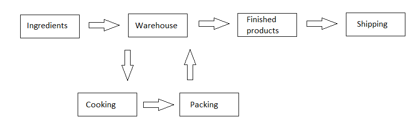

# delivering

[English](delivering.md) | [Русский](delivering.ru.md)

Наименование: **Доставка**.

`delivering` - это паттерн реализации бизнес-процессов, которые связаны с созданием заказа на доставку, а также оплатой и доставкой заказа. 

Данная диаграмма демонстрирует жизненный цикл продукта или заказа на доставку еды:

### Flowchart-диаграммы для сетевого взаимодействия

## Структуры данных

При обработке заказа (регистрация заказа, оплата, приготовление, доставка) используются следующие объекты/DTO:

| Объект | DTO | Пояснения |
| --- | ---- | --- |
| [InitialOrder](../../models/Orders/InitialOrder.cs) | InitialOrderDTO | модель для заведения заказа |
| [DeliveryOrder](https://github.com/alexeysp11/workflow-lib/blob/main/src/Models/Business/BusinessDocuments/DeliveryOrder.cs) | DeliveryOrderDTO  | модель для выставления счёта, или доставки продуктов из магазина на склад |
| [DeliveryWh2Kitchen](../../models/Orders/DeliveryWh2Kitchen.cs) | DeliveryWh2KitchenDTO | модель для переноса продуктов со склада на кухню (пункт отправки, пункт назначения, время начала, время конца, продукты, ингридиенты) |
| [CookingOperation](https://github.com/alexeysp11/workflow-lib/blob/main/src/Models/Business/Products/CookingOperation.cs) | CookingOperationDTO | модель для приготовления заказа (время начала, время конца, продукты, ингридиенты, рецепты) |
| [DeliveryKitchen2Wh](../../models/Orders/DeliveryKitchen2Wh.cs) | DeliveryKitchen2WhDTO | модель для переноса готового заказа из кухни на склад (пункт отправки, пункт назначения, время начала, время конца, продукты, номер заказа, сгенерированный QR-код заказа) |
| [DeliveryOperation](https://github.com/alexeysp11/workflow-lib/blob/main/src/Models/Business/Delivery/DeliveryOperation.cs) | DeliveryOperationDTO  | модель для доставки (QR-код на заказе, QR-код на рюкзаке, пункт отправки, пункт назначения, время начала, время конца, номер заказа) |
