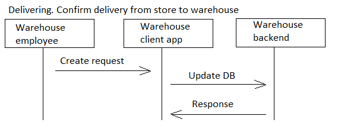
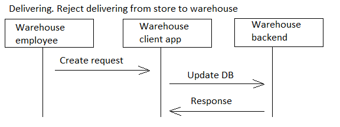

# confirmstore2wh

[English](confirmstore2wh.md) | [Русский](confirmstore2wh.ru.md)

Name: **Confirm delivery from store to warehouse**.

The scenario responsible for delivering products from store to warehouse by couriers involves receiving requests for specific products from warehouse employees, buying those products in the store, packaging them for transport, and delivering them to the warehouse in a timely manner.

Flowchart name: [delivering](../../flowchartsteps/delivering/README.md)

Responsible modules: [client application](../../frontend/courierclient.md), [backend service](../../backend/courierbackend.md)

Platform version: v0.1

## Dependencies

### Depends on

### Influences on

## Process description

This process provides the implementation of the [delivering](../../flowchartsteps/delivering/README.ru.md) process pattern:

### Flowcharts for network communication

### Step-by-step execution plan of the process

### Sequence diagrams

