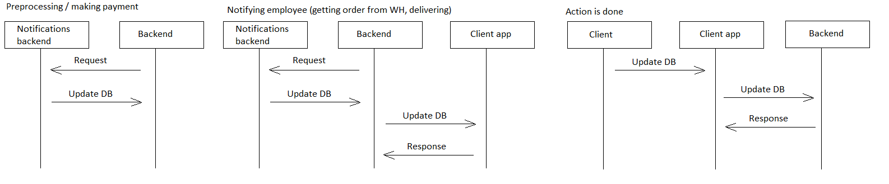

# deliverorder

[English](deliverorder.md) | [Русский](deliverorder.ru.md)

Name: **Deliver order to customer**.

The scenario responsible for delivering order to customer by couriers involves using a mobile app or GPS-enabled device to navigate to the customer's location, delivering the order in a timely and professional manner, and obtaining any necessary signatures or other proof of delivery.

Flowchart name: [delivering](../../flowchartsteps/delivering/README.md)

Responsible modules: [client application](../../frontend/courierclient.md), [backend service](../../backend/courierbackend.md)

Platform version: v0.1

## Dependencies

### Depends on

| Backend service | Process |
| --- | ---- |
| [customerbackend](../../backend/customerbackend.md) | [preprocessorder](../delivering/preprocessorder.md) |

### Influences on

| Backend service | Process |
| --- | ---- |
| [notificationsbackend](../../backend/notificationsbackend.md) | [sendnotifications](../notificationsbackend/sendnotifications.md) |
| [courierbackend](../../backend/courierbackend.md) | [updatedeliverystatus](../delivering/updatedeliverystatus.md) |
| [courierbackend](../../backend/courierbackend.md) | [scanbackpack](../delivering/scanbackpack.md) |
| [courierbackend](../../backend/courierbackend.md) | [scanqronorder](../delivering/scanqronorder.md) |
| [customerbackend](../../backend/customerbackend.md) | [makepayment](../delivering/makepayment.md) |

## Process description

This process is responsible for providing of information on orders carried/carried by the courier (order number, place of delivery, actual/estimated time of delivery).

Functionalities that could be added in the next versions of the platform:
- Building the most optimal route for delivery.
- Display the location of the courier on the map.

### Flowcharts for network communication

### Step-by-step execution plan of the process

- The courier opens the app on their device.
- The courier selects the delivery order they are working on.
- The courier registers the backpack and the order, launching the [scanbackpack](scanbackpack.md) and [scanqronorder](scanqronorder.md) processes.
- The [updatedeliverystatus](../delivering/updatedeliverystatus.md) process is launched in order to start delivery.
- The courier navigates to the delivery address using the app's map feature.
- The courier delivers the order to the customer and obtains a signature or confirmation code.
- The courier marks the delivery order as complete in the system.
- When the courier marks the order as completed, the [updatedeliverystatus](../delivering/updatedeliverystatus.md) process is launched to complete delivery.

### Sequence diagrams

## Data structures

| Object | DTO | Database table |
| --- | ---- | --- |
| [Employee](https://github.com/alexeysp11/workflow-lib/blob/main/src/Models/Business/InformationSystem/Employee.cs) | - | - |
| DeliveryStatus | - | - |
| [DeliveryOperation](https://github.com/alexeysp11/workflow-lib/blob/main/src/Models/Business/Delivery/DeliveryOperation.cs) | - | - |
