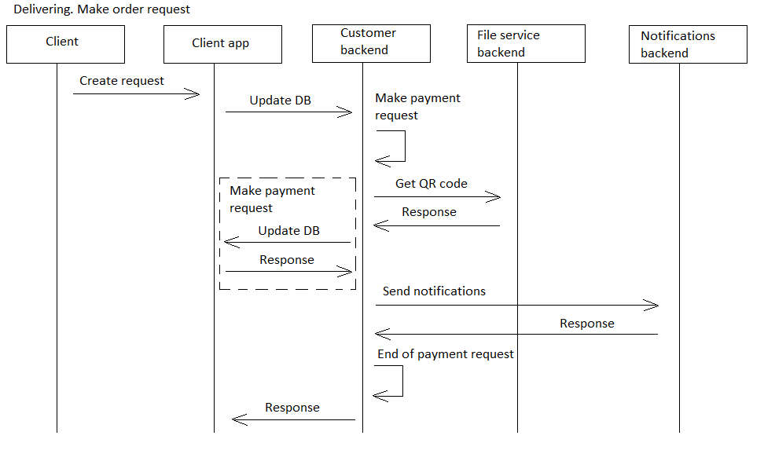

# makeorder

[English](makeorder.md) | [Русский](makeorder.ru.md)

Name: **Make order**.

The overall description of the scenario for placing an order in the customer backend service is that it allows customers to select items from a menu, customize their order with special requests or dietary restrictions, choose a delivery time and location, and submit their order for processing. 

The interactive steps within the scenario include browsing the menu, selecting items and customizations, entering delivery details, and confirming the order.

Flowchart name: [delivering](../../flowchartsteps/delivering/README.md)

Responsible modules: [client application](../../frontend/customerclient.md), [backend service](../../backend/customerbackend.md)

Platform version: v0.1

## Dependencies

### Influences on

| Backend service | Process |
| --- | ---- |
| [customerbackend](../../backend/customerbackend.md) | [makepayment](../delivering/makepayment.md) |
| [customerbackend](../../backend/customerbackend.md) | [preprocessorder](../delivering/preprocessorder.md) |

## Process description

The main process in the application [customer app](../../frontend/customerclient.md) that is responsible for registering the order in the application and includes electronic payment logic.

### Flowcharts for network communication

### Step-by-step execution plan of the process

- The user browses through the list of available products and selects the ones they want to order.
- They proceed to checkout and select preferred delivery option, enter their delivery address and contact details, select their preferred payment method (cash on delivery, POS when receiving, using QR code, using CVC), then confirm the order.
- The client-side app validates date and stores some cache.
- Start the [makepayment](makepayment.md) process.
- Then within the process [preprocessorder](preprocessorder.md) the information entered by the user is sent to the database and to [customerbackend](../../backend/customerbackend.md), which also notifies [kitchenbackend](../../backend/kitchenbackend.md).
- The user is on the [Pending orders](pendingorders.md) page where they can track the status of their order in real-time.

### Sequence diagrams

## Data structures

| Object | DTO |
| --- | ---- |
| [Product](https://github.com/alexeysp11/workflow-lib/blob/main/src/Models/Business/Products/Product.cs) | - |
| [ProductCategory](https://github.com/alexeysp11/workflow-lib/blob/main/src/Models/Business/Products/ProductCategory.cs) | - |
| [DeliveryOrder](https://github.com/alexeysp11/workflow-lib/blob/main/src/Models/Business/BusinessDocuments/DeliveryOrder.cs) | DeliveryOrderDTO |
| [InitialOrder](../../../src/models/Orders/InitialOrder.cs) | InitialOrderDTO |
