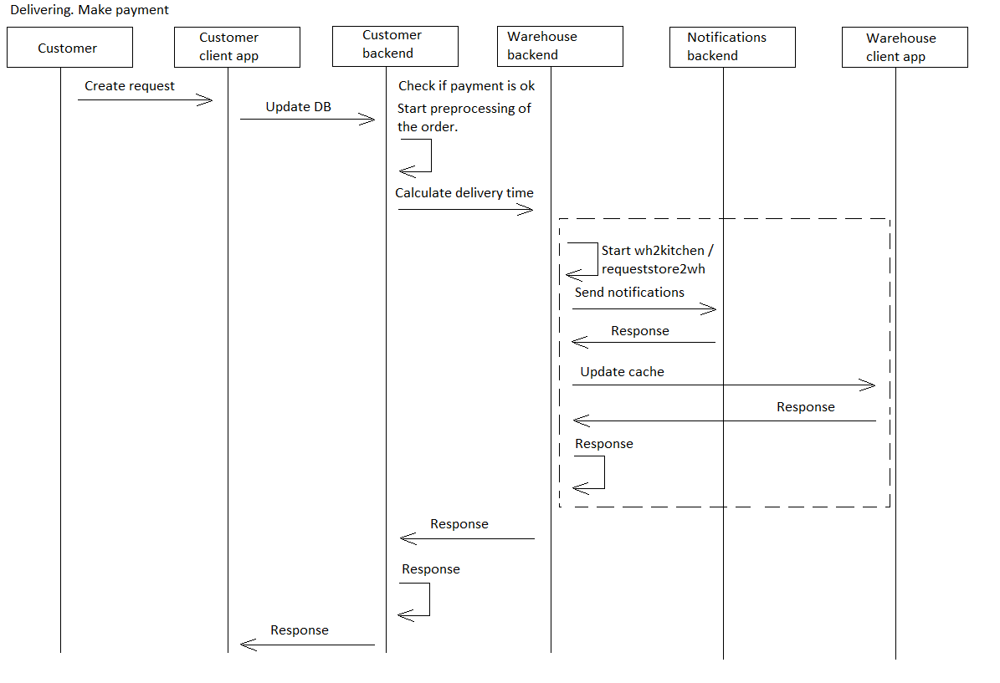

# makepayment

[English](makepayment.md) | [Русский](makepayment.ru.md)

Наименование: **Совершение оплаты**.

Сценарий оплаты в приложении службы доставки предполагает, что пользователь выбирает способ оплаты и предоставляет свою платежную информацию для завершения транзакции по своему заказу.
Приложение безопасно обрабатывает платеж и предоставляет подтверждение успешной транзакции.

Наименование flowchart-диаграммы: [delivering](../../flowchartsteps/delivering/README.ru.md)

Ответственные модули: [клиентское приложение](../../frontend/customerclient.ru.md), [бэкенд-сервис](../../backend/customerbackend.ru.md)

Версия платформы: v0.1

## Зависимости

### Зависит от

| Бэкэнд-сервис | Процесс |
| --- | ---- |
| [customerbackend](../../backend/customerbackend.ru.md) | [makeorder](../delivering/makeorder.ru.md) |
| [courierbackend](../../backend/courierbackend.ru.md) | [deliverorder](../delivering/deliverorder.ru.md) |

### Влияет на

| Бэкэнд-сервис | Процесс |
| --- | ---- |
| [fileservice](../../backend/fileservice.ru.md) | [generateqr](../fileservice/generateqr.ru.md) |

## Описание процесса

[Приложение для клиентов](../../frontend/customerclient.md) позволяет пользователям осуществлять оплату своих заказов, используя различные способы оплаты.

Данный процесс ответственен за осуществление оплаты за заказ. Данный процесс вызывается в рамках процесса [makeorder](../delivering/makeorder.ru.md) либо после [deliverorder](../delivering/deliverorder.ru.md).

### Flowchart-диаграммы для сетевого взаимодействия

### План пошагового выполнения процесса

- Когда клиент размещает заказ, ему необходимо выбрать предпочтительный способ оплаты (см. [makeorder](../delivering/makeorder.ru.md)).
- Если они выбирают **наложенный платеж**, они подтверждают заказ и платят курьеру при получении заказа.
- Если они выберут **POS при получении**, они подтвердят заказ и оплатят его кредитной или дебетовой картой при получении заказа.
- Если они выберут **использование QR-кода**, они сканируют QR-код, предоставленный приложением, и подтвердят платеж.
    - [бэкенд-сервис для потребителя](../../backend/customerbackend.md) отправляет запрос в [fileservice](../../backend/fileservice.md) для создания QR-кода для оплаты.
- Если они выберут **использование CVC**, они введут данные своей карты и подтвердят платеж.
    - Добавьте способ оплаты после заполнения формы, если в качестве типа оплаты выбрана карта.
- Приложение подтверждает платеж и отправляет его на бэкенд сервис.

### Диаграммы последовательности

Фактически выполнение данного процесса с точки зрения HTTP-запросов ограничивается получением данных об ориентировочном времени доставки заказа. 

Согласно пошаговому выполнению, данный запрос должен сохранять информацию о последовательности вызываемых процессов (это сделано для удобства проектирования и понимания системы). 
Однако фактически данный процесс обновляется внутри HTTP-запросов, выполняющихся в рамках дочерних процессов.

Например, после приготовления заказа и его передачи на склад, согласно диаграмме пошагового выполнения, вызывается процесс [sendnotifications](../../processes/notificationsbackend/sendnotifications.ru.md) (см. также диаграмму последовательности процесса [getnotified](../../processes/notificationsbackend/getnotified.ru.md)).

## Структуры данных

### Объекты 

- [Payment](https://github.com/alexeysp11/workflow-lib/blob/main/src/Models/Business/Monetary/Payment.cs)
