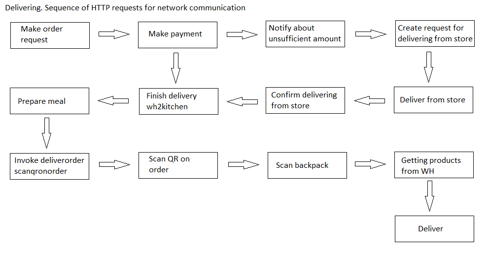
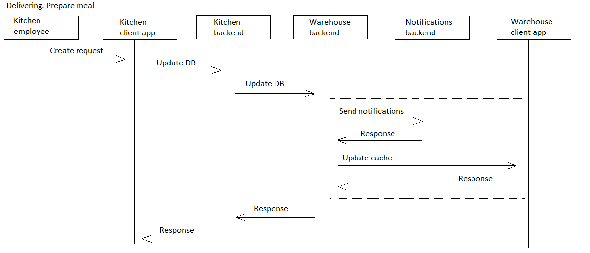
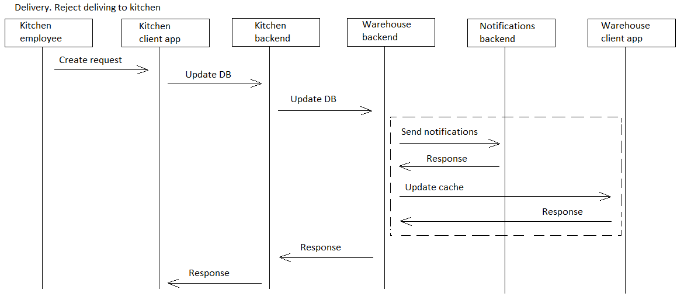

# preparemeal

[English](preparemeal.md) | [Русский](preparemeal.ru.md)

Наименование: **Приготовить заказ**.

Сценарий приготовления еды в приложении службы доставки включает в себя получение сведений о заказе из базы данных, расчет необходимых ингредиентов и инструкций по приготовлению, а также приготовление еды в соответствии с этими инструкциями.
Приложение обновляет статус заказа по мере его подготовки и уведомляет персонал кухни, когда он будет готов к доставке.

Наименование flowchart-диаграммы: [delivering](../../flowchartsteps/delivering/README.ru.md)

Ответственные модули: [клиентское приложение](../../frontend/kitchenclient.ru.md), [бэкэнд-сервис](../../backend/kitchenbackend.ru.md)

Версия платформы: v0.1

## Зависимости

### Зависит от

| Бэкэнд-сервис | Процесс |
| --- | ---- |
| [customerbackend](../../backend/customerbackend.ru.md) | [preprocessorder](../delivering/preprocessorder.ru.md) |

## Описание процесса

Данный процесс вызывается из процесса [preprocessorder](../delivering/preprocessorder.ru.md).

### Flowchart-диаграммы для сетевого взаимодействия

### План пошагового выполнения процесса

- Клиент оформляет заказ через приложение службы доставки.
- После нескольких шагов заказ наконец получен серверной службой кухни.
- Персонал кухни проверяет заказ и приступает к приготовлению еды.
- Пока еда готовится, статус заказа обновляется в приложении в режиме реального времени.
- Как только еда будет готова, сотрудники кухни изменят статус заказа на "готово к самовывозу" или "отправлено на доставку".
- Водители-курьеры получают информацию о заказе и место получения через приложение.
- Водители-экспедиторы забирают еду и доставляют ее покупателю.

### Диаграммы последовательности

