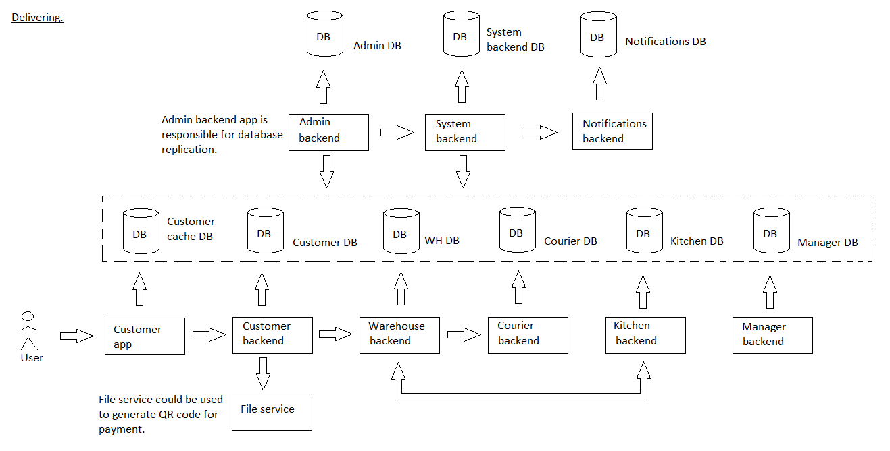

# scanqronorder

[English](scanqronorder.md) | [Русский](scanqronorder.ru.md)

Name: **Scan QR code on order**.

The scenario responsible for scanning QR code on order before delivering by couriers involves using a mobile app or handheld scanner to scan a unique QR code associated with each order. 
This verifies that the correct order is being delivered and provides real-time tracking information to the delivery service company and the customer.

Flowchart name: [delivering](../../flowchartsteps/delivering/README.md)

Responsible modules: [client application](../../frontend/courierclient.md), [backend service](../../backend/courierbackend.md)

Platform version: v0.1

## Dependencies

### Depends on

| Backend service | Process |
| --- | ---- |
| [courierbackend](../../backend/courierbackend.md) | [deliverorder](../delivering/deliverorder.md) |

## Process description

This process is responsible for registration of the delivery order using a QR code: start/end of work with the order.

Despite the fact that this process belongs to the macroprocess [delivering](../../flowchartsteps/delivering/README.ru.md), the implementation of this process is similar to the processes included in the macroprocess [maintenance](../../processpatterns/maintenance.ru.md), in the context of user notification:

### Flowcharts for network communication

### Step-by-step execution plan of the process

- The courier opens the app on their device.
- The courier selects the delivery order they are working on.
- The courier scans the QR code on the delivery order using their device's camera.
- The system verifies the QR code and displays the details of the delivery order to the courier.

### Sequence diagrams

## Data structures

| Object | DTO | Database table |
| --- | ---- | --- |
| QRCode | - | - |
| [DeliveryOrder](https://github.com/alexeysp11/workflow-lib/blob/main/src/Models/Business/BusinessDocuments/DeliveryOrder.cs) | - | - |
| [Employee](https://github.com/alexeysp11/workflow-lib/blob/main/src/Models/Business/InformationSystem/Employee.cs) | - | - |
| - | DeliveryStartDTO | - |

- QRCode object could have properties like codeValue, expirationDate, etc. 
- Order object could have properties like orderNumber, customer details, product details, QR code, etc. 
- Courier object could have properties like name, ID, vehicle type, etc. 
- DeliveryStartDTO could have properties like orderNumber, courierName, qrCodeValue, deliveryDate, etc.
