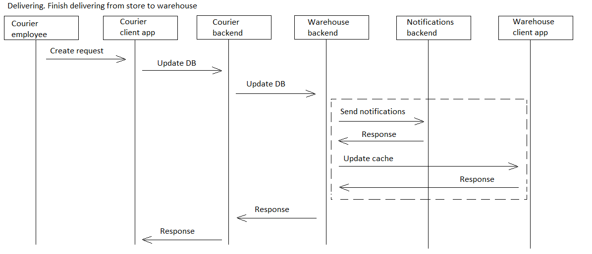

# store2wh

[English](store2wh.md) | [Русский](store2wh.ru.md)

Наименование: **Доставка заказа из магазина на склад**.

Сценарий, отвечающий за доставку товаров из магазина на склад курьерами, предполагает получение запросов на конкретные товары от сотрудников склада, покупку этих товаров в магазине, их упаковку для транспортировки и своевременную доставку на склад.

Наименование flowchart-диаграммы: [delivering](../../flowchartsteps/delivering/README.ru.md)

Ответственные модули: [клиентское приложение](../../frontend/courierclient.md), [бэкэнд-сервис](../../backend/courierbackend.md)

Версия платформы: v0.1

## Зависимости

### Зависит от

| Бэкэнд-сервис | Процесс |
| --- | ---- |
| [customerbackend](../../backend/customerbackend.ru.md) | [preprocessorder](../delivering/preprocessorder.ru.md) |
| [warehousebackend](../../backend/warehousebackend.ru.md) | [wh2kitchen](../warehouse/wh2kitchen.ru.md) |
| [kitchenbackend](../../backend/kitchenbackend.ru.md) | [requestingedients](../kitchen/requestingedients.ru.md) |
| [managerbackend](../../backend/managerbackend.ru.md) | [inventorylevels](../manager/inventorylevels.ru.md) |

### Влияет на

| Бэкэнд-сервис | Процесс |
| --- | ---- |
| [notificationsbackend](../../backend/notificationsbackend.ru.md) | [sendnotifications](../notificationsbackend/sendnotifications.ru.md) |

## Описание процесса

Нюансы, связанные с реализацией данного бэкенд-сервиса:
- При запуске данного процесса необходимо передавать в качестве параметров среди прочего следующие: 
    - **бэкенд-сервис, из которого был запущен процесс**;
    - **бэкенд-сервис, который будет запущен из данного процесса** (обычно при проектировании внешних процессов рекомендуется возвращать ответ на тот же бэкенд-сервис, из которого был совершён запуск зависимого процесса, но данный параметр является способом задать зависимости между микросервисами в более явном виде);
    - **тип соответствующего клиентского приложения** (по умолчанию используется тот, который соотносится с бэкенд-сервисом, из которого запустился данный процесс); 
    - **наименование и количество продуктов, которые необходимо купить** (если процесс запускается из [preprocessorder](../delivering/preprocessorder.ru.md), то данный параметр является обязательным).
- Зона ответственности, в которой стартует данный процесс, остаётся той же самой, что и у внешнего бэкенд-сервиса, который его вызвал.
- Для упрощения процесса проектирования и разработки на начальных этапах, исходим из идеи, что магазин с оптимальным соотношением цены и качества уже выбран (например, вследствие контрактов, заключенных в рамках управления отношений с контрагентами, или заранее установленный адрес ближайшего магазина). Это означает, что **бэкенд-сервису не нужно рассчитывать, в каком магазине выгоднее купить продукцию**, соответственно, **информация по магазину будет получена из БД**. 
- Построение наиболее оптимального маршрута доставки и отображение местоположения курьера на карте является важной составляющей реального приложения сервиса доставки, но **в данном прототипе приложения эти функции в настоящий момент не реализованы** в целях уменьшения сложности проектирования и реализации.

Данный процесс обеспечивает реализацию паттерна процессов [delivering](../../flowchartsteps/delivering/README.ru.md):

### Flowchart-диаграммы для сетевого взаимодействия

### План пошагового выполнения процесса

- Бэкенд-сервис, в зоне ответственности которого запущен данный процесс, уведомляет сотрудника, который запустил процесс, о необходимости уточнить, какие именно продукты необходимо доставить из магазина (это действие выполняется только в том случае, если в числе параметров **не заполнен** список продуктов для покупки).
- Сотрудник создает в системе заказ на доставку: список продуктов, магазин (загружается автоматически из БД).
- Информация о заказах, перевозимых курьером (номер заказа, место доставки, фактическое/расчетное время доставки).
- Уведомление приходит на бэкенд-сервис курьерского приложения.
- Система назначает курьера заказу на доставку.
- Курьер принимает заказ в работу.
- Построение наиболее оптимального маршрута доставки.
- Отображение местоположения курьера на карте.
- Курьер забирает товары из магазина и загружает их в свой автомобиль.
- Курьер доставляет продукцию на склад.
- Курьер отмечает в системе заказ на доставку как выполненный, в качестве подтверждения прикладывается фото чека.

### Диаграммы последовательности

