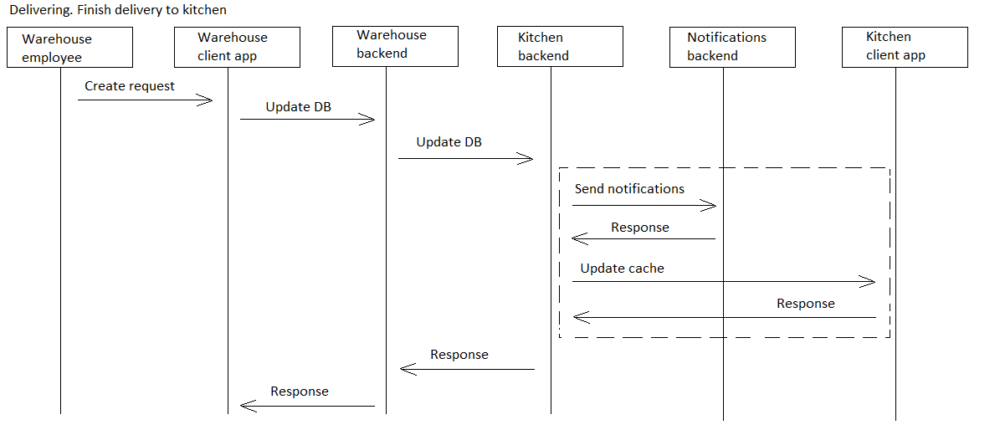

# wh2kitchen

[English](wh2kitchen.md) | [Русский](wh2kitchen.ru.md)

Наименование: **Доставить со склада на кухню**.

Сценарий, отвечающий за доставку ингредиентов со склада на кухню сотрудниками склада компании, занимающейся доставкой, предполагает получение запросов от персонала кухни на конкретные ингредиенты, размещение этих ингредиентов на складе, их упаковку для транспортировки и доставку на кухню в своевременно.

Наименование flowchart-диаграммы: [delivering](../../flowchartsteps/delivering/README.ru.md)

Ответственные модули: [клиентское приложение](../../frontend/warehouseclient.md), [бэкенд-сервис](../../backend/warehousebackend.md)

Версия платформы: v0.1

## Зависимости

### Зависит от

| Бэкэнд-сервис | Процесс |
| --- | ---- |
| [customerbackend](../../backend/customerbackend.md) | [preprocessorder](../../processes/customer/preprocessorder.md) |

### Влияет на

| Бэкэнд-сервис | Процесс |
| --- | ---- |
| [notificationsbackend](../../backend/notificationsbackend.ru.md) | [sendnotifications](../../processes/notificationsbackend/sendnotifications.ru.md) |
| [courierbackend](../../backend/courierbackend.ru.md) | [store2wh](../delivering/store2wh.ru.md) |

## Описание процесса

Общее описание сценария доставки со склада на склад в бэкэнд-сервисе склада заключается в том, что он позволяет сотрудникам склада управлять потоком продукции от хранилищ до производства.

Интерактивные шаги, описанные в настоящем документе, включают запрос запросов на доставку с кухни, выбор продуктов для доставки, подготовку продуктов к транспортировке и обработку результатов доставки.

### Flowchart-диаграммы для сетевого взаимодействия

### План пошагового выполнения процесса

- Склад получает уведомление: 
    - Список необходимых исходных продуктов и их количеством/весом/объемом.
- Вручную проводится проверка на соответствие количества/веса/объема необходимых исходных продуктов их реальному количеству/весу/объему.
- Если реальных продуктов недостаточно, то сотрудник склада должен зафиксировать это в приложении (обновляется БД) и запустить процесс [Доставить из магазина на склад](../delivering/store2wh.ru.md).
    - Также на этом этапе уведомляется менеджер (поскольку это коллизия планирования/учета продуктов)
- Если реальных продуктов достаточно, то списать необходимое количество, отнести их на кухню и закрыть процесс.
- Получать запросы на доставку с кухни
- Выберите товары, необходимые для доставки
- Подготовьте продукцию к транспортировке, например, упакуйте ее в коробки или ящики.
- Обновите статус доставки, чтобы указать, что продукты забраны и находятся на пути на кухню.

### Диаграммы последовательности

