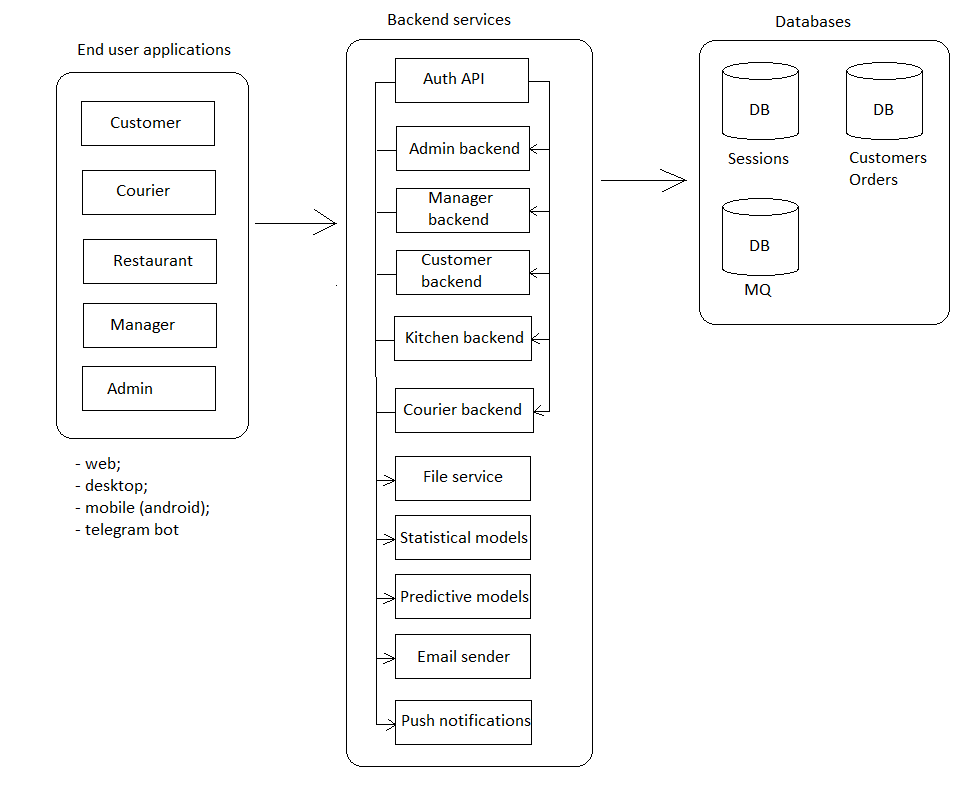

# courierclient

Доступно на других языках: [English/Английский](courier.md), [Russian/Русский](courier.ru.md). 

Клиенсткое приложение для курьера 

## Требования к системе и её описание 

### Общая модель системы

### Описание приложения для курьера

- Процессы:
    - [Отсканировать QR-код на рюкзаке](processes/courier.scanbackpack.ru.md) (для отметки начала/конца работы).
    - [Доставка заказа потребителю](processes/courier.deliverorder.ru.md).
    - [Доставка заказа из магазина на склад](processes/courier.store2wh.ru.md).

Описание бэкенд-сервиса приложения для курьера представлено по [данной ссылке](../backend/courierbackend.ru.md).
