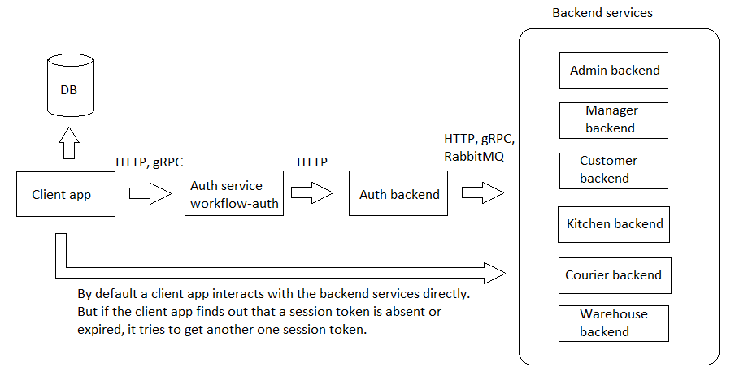

# managerclient

Read this in other languages: [English](managerclient.md), [Russian/Русский](managerclient.ru.md). 

`managerclient` is a client-side application that is used by business owners to access analytics and reporting tools.

## Requirements and description of the system

### Overall description of the system 

## Authentiacation 

[workflow-auth](https://github.com/alexeysp11/workflow-auth) is used as an external **authentication service**.

### Sign in

