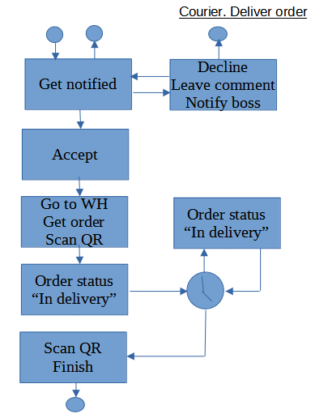

# courier.deliverorder

Read this in other languages: [English](courier.deliverorder.md), [Russian/Русский](courier.deliverorder.ru.md). 

Courier client application: deliver order

The description of the **client application** is presented at [this link](../courierclient.md).

## Process description

- Registration of the consumer's order using a QR code: start/end of work with the order.
- Information on orders carried/carried by the courier (order number, place of delivery, actual/estimated time of delivery).
- Building the most optimal route for delivery.
- Display the location of the courier on the map.

## Sequence of user actions

