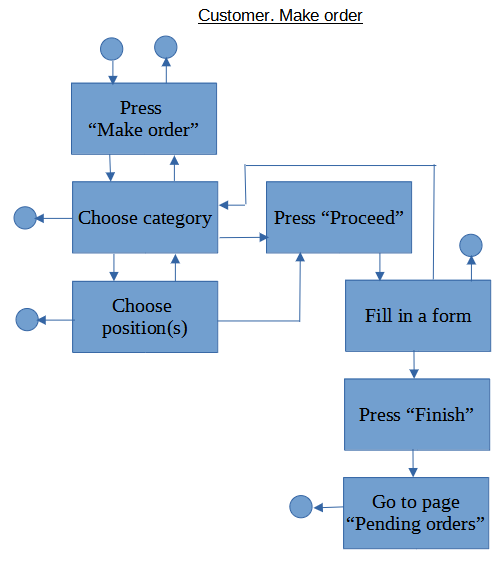

# customer.makeorder

Доступно на других языках: [English/Английский](customer.makeorder.md), [Russian/Русский](customer.makeorder.ru.md). 

Клиентское приложение для потребителя: оформление заказа 

Описание клиентского приложения представлено по [данной ссылке](../customerclient.ru.md).

## Описание процесса

- Отображение меню: 
    - Выгружается из бэкенда: категории, отдельные позиции (наименование, картинка, цена, описание).
- При оформлении заказа:
    - Вводит пользователь: список выбранных позиций из меню, размер, количество, место доставки;
    - Высчитывается на бэкенде: общая сумма заказа, ориентировочное время готовки и доставки.
- Отправка запроса на [fileservice](../../backend/fileservice.ru.md) для формирования QR-кода для оплаты.
- Использование предиктивных моделей: ориентировочное время готовки и доставки.

## Последовательность действий пользователя

- Пользователь открывает форму для оформления заказа.
- Выбрать категорию.
- Выбрать продукт, указать количество и размер.
- Пользователь нажимает "Продолжить".
- Заполнение формы для доставки: адрес доставки, вид оплаты, способ доставки (пешком, электросамокат, автомобиль).
    - Некоторая информация предварительно загружается из БД: ориентировочная длительность похода до магазина, готовки, прайс за доставку.
    - После заполнения адреса для доставки, можно нажать "Рассчитать время доставки": на бэкграунде строится маршрут от склада до указанного адреса и потом отображается приблизительное время доставки.
    - При изменении способа доставки, меняется прайс за доставку.
    - В качестве адреса доставки можно указать склад.
- Пользователь нажимает "Завершить оформление": 
    - Информация, введенная пользователем, отправляется в БД и на [customerbackend](../../backend/customerbackend.ru.md), который также уведомлет [kitchenbackend](../../backend/kitchenbackend.ru.md).
    - Добавить payment geteway после заполнения формы, если выбрана карта.
    - Все выбранные продукты хранятся на стороне фронтенда до тех пор, пока пользователь не нажмёт "Завершить оформление".
- Пользователь оказывается на странице "Текущие заказы".
