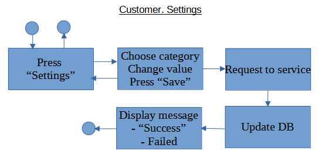

# customer.settings

Доступно на других языках: [English/Английский](customer.settings.md), [Russian/Русский](customer.settings.ru.md). 

Клиентское приложение для потребителя: настройки

Описание **клиентского приложения** представлено по [данной ссылке](../customerclient.ru.md).

## Описание процесса

- Страница настроек и персональных данных: 
    - Персональная информация:
       - логин, 
    - Коммуникация:
       - email,
       - телефон,
       - подключенные мессенджеры: WhatsApp, Viber, Telegram,
       - никнейм в Telegram,
       - предпочитаемый способ связи: эл.почта, телефон, один из мессенджеров,
    - Оплата:
       - предпочитаемый вид оплаты,
       - привязанные карты.
    - Юзабилити:
       - место доставки по умолчанию,
       - расширение файла для загрузки по умолчанию (*возможно, этот параметр не понадобится*).
    - Безопасность:
       - пароль.

## Последовательность действий пользователя

- Пользователь открывает "Настройки".
- Пользователь листает список настроек, выбирает категорию и конкретный параметр.
- Внизу страницы есть кнопка "Сохранить изменения".
    - Изменения попадают на сервисы, после ответа от сервиса - в БД.
    - После этого отображаются у пользователя на интерфейсе: "Успешно" или "Произошла ошибка".
