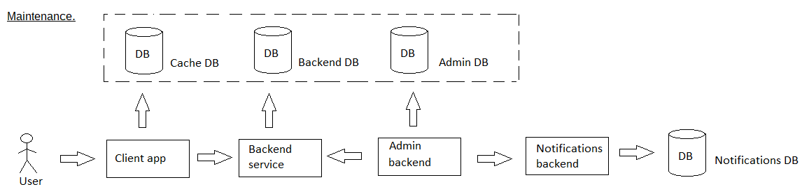

# callrouting

[English](callrouting.md) | [Русский](callrouting.ru.md)

Наименование: **Маршрутизация вызовов**.

Процесс маршрутизации и переадресации вызовов отвечает за управление входящими вызовами и их направление соответствующим получателям на основе предопределенных правил или предпочтений пользователя. 
Это может включать в себя такие функции, как переадресация вызовов, организация очереди вызовов, системы интерактивного голосового ответа (IVR) и интеграцию с другими каналами связи.

Паттерн процесса: [maintenance](../../processpatterns/maintenance.ru.md)

Ответственные модули: [клиентское приложение](../../frontend/adminclient.ru.md), [бэкенд-сервис](../../backend/adminbackend.ru.md)

Версия платформы: v0.6

## Описание процесса

### План пошагового выполнения процесса

Пошаговый план выполнения маршрутизации и переадресации вызовов в серверной службе администрирования, связанной с IP-телефонией, включает определение правил маршрутизации вызовов, настройку параметров переадресации вызовов, настройку телефонных шлюзов или систем АТС, тестирование функций маршрутизации вызовов и обеспечение надежной связи. для голосовых вызовов в приложении службы доставки.

- Администратор определяет правила маршрутизации вызовов на основе заранее определенных критериев, таких как идентификатор вызывающего абонента, время суток или предпочтения пользователя.
- Администратор настраивает системы переадресации вызовов, организации очереди вызовов или интерактивного голосового ответа (IVR) для управления входящими вызовами.
- Администратор отслеживает и при необходимости корректирует настройки маршрутизации вызовов на основе трафика вызовов и отзывов пользователей.
