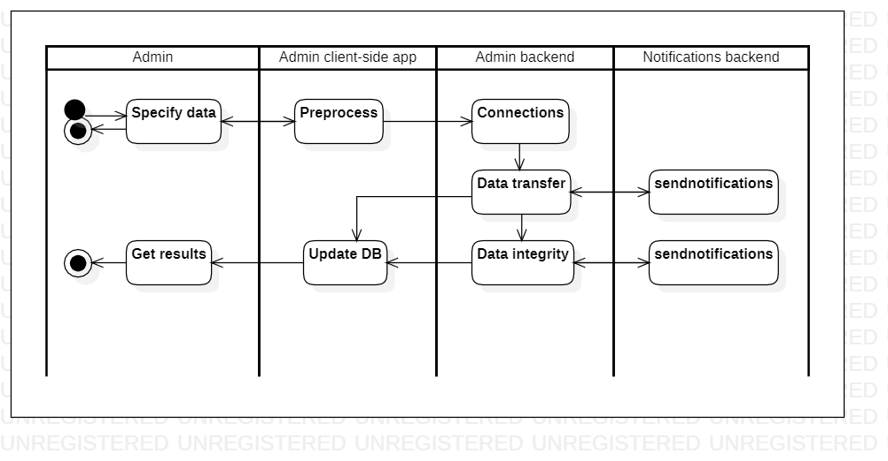

# dbreplication

[English](dbreplication.md) | [Русский](dbreplication.ru.md)

Наименование: **Репликация базы данных**.

Сценарий репликации базы данных администратором в компании службы доставки.

Паттерн процесса: [maintenance](../../processpatterns/maintenance.ru.md)

Ответственные модули: [клиентское приложение](../../frontend/adminclient.ru.md), [бэкенд-сервис](../../backend/adminbackend.ru.md)

## Зависимости

### Зависит от

| Бэкэнд-сервис | Процесс |
| --- | ---- |
| [adminbackend](../../backend/adminbackend.md) | [manageaccesslevels](../admin/manageaccesslevels.md) |
| [adminbackend](../../backend/adminbackend.md) | [managepermissions](../admin/managepermissions.md) |
| [kitchenbackend](../../backend/kitchenbackend.md) | [changemenu](../kitchen/changemenu.md) |
| [kitchenbackend](../../backend/kitchenbackend.md) | [changerecipe](../kitchen/changerecipe.md) |
| [managerbackend](../../backend/managerbackend.md) | [changeproductprice](../manager/changeproductprice.md) |
| [managerbackend](../../backend/managerbackend.md) | [inventorylevels](../manager/inventorylevels.md) |

### Влияет на

| Бэкэнд-сервис | Процесс |
| --- | ---- |
| [notificationsbackend](../../backend/notificationsbackend.ru.md) | [sendnotifications](../notificationsbackend/sendnotifications.ru.md) |

## Описание процесса

### Пошаговое выполнение

- Войдите в систему как администратор.
- Доступ к инструменту репликации базы данных.
- Администратор выбирает исходную и целевую базы данных для репликации.
- Система устанавливает соединение между исходной и целевой базами данных.
- Система инициирует процесс передачи данных и контролирует его ход.
- Система проверяет целостность и согласованность данных между исходной и целевой базами данных.
- Администратор подтверждает успешную репликацию и активирует целевую базу данных.

