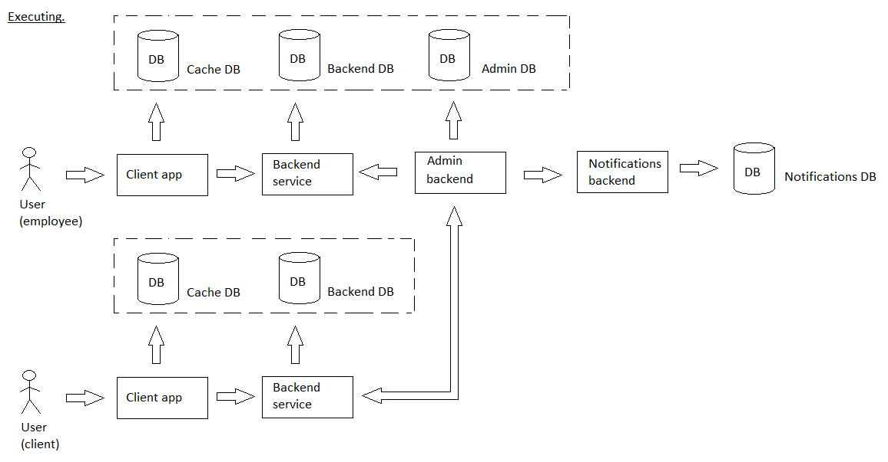

# majorchangerequest

[English](majorchangerequest.md) | [Русский](majorchangerequest.ru.md)

Name: **Major change request**.

A scenario that is responsible for logging and tracking the execution of requests that involve significant changes to the system (such requests are called **major change requests**).

It can be beneficial to separate change requests based on the scale of changes required. 
For example, large-scale change requests that involve architectural solutions or significant work could be categorized as [major change requests](../admin/majorchangerequest.md), while smaller changes such as database modifications or minor updates could be categorized as [minor change requests](../admin/minorchangerequest.md). 
This can help in prioritizing and managing change requests more effectively.

Process pattern: [executing](../../processpatterns/executing.md)

Responsible modules: [client application](../../frontend/adminclient.md), [backend service](../../backend/adminbackend.md)

## Process description

### Step-by-step execution

- Establish a system for logging and tracking requests that involve significant changes to the system, such as software updates or configuration changes.
- Require detailed documentation and approval for significant changes before they are implemented.
- Regularly review logs and reports of significant changes to ensure compliance with company policies and standards.

