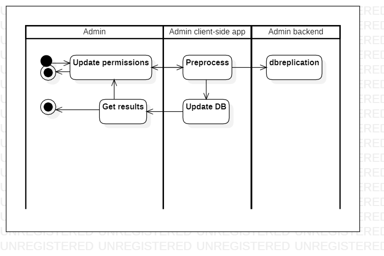

# managepermissions

[English](managepermissions.md) | [Русский](managepermissions.ru.md)

Name: **Manage permissions**.

The scenario responsible for managing permissions by admin in the delivery service company involves setting up user accounts with appropriate levels of access to different systems and data, modifying permissions as needed, and ensuring that access is granted only to authorized users.

Process pattern: [requesting](../../processpatterns/requesting.md)

Responsible modules: [client application](../../frontend/adminclient.md), [backend service](../../backend/adminbackend.md)

Platform version: v0.1

## Dependencies

### Influences on

| Backend service | Process |
| --- | ---- |
| [adminbackend](../../backend/adminbackend.md) | [dbreplication](../admin/dbreplication.md) |

## Process description

### Step-by-step execution plan of the process

- Admin opens the app.
- Admin selects "Manage Permissions" option.
- The system displays a list of employees and their current permissions.
- The admin selects an employee and updates their permissions.
- The system updates the employee's permissions in the database.

## Data structures

### Objects 

- User roles model: This model could include properties such as role name, description, and permissions. It could also have methods for managing user roles.
- Permission levels model: This model could include properties such as permission name, description, and access control lists. It could also have methods for managing permission levels.
- Access control lists model: This model could include properties such as resource name, resource type, and user or group permissions. It could also have methods for managing access control lists.
