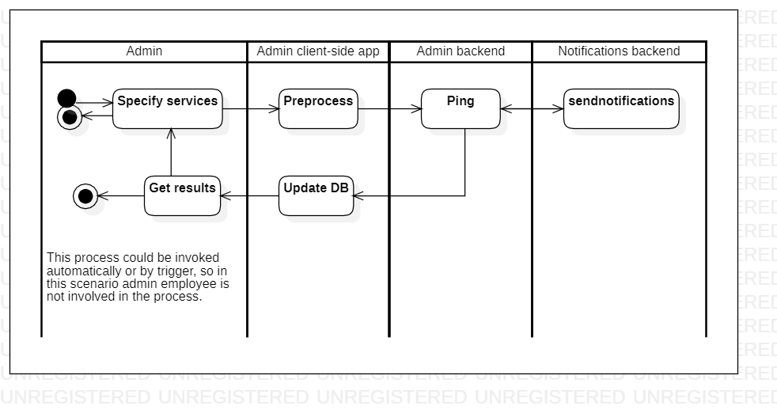

# pingservices

[English](pingservices.md) | [Русский](pingservices.ru.md)

Name: **Ping services**.

The scenario responsible for pinging services by admin in the delivery service company involves using a monitoring tool to check the availability and performance of various services, such as delivery tracking or inventory management, and receiving alerts if any issues are detected.

Process pattern: [maintenance](../../processpatterns/maintenance.md)

Responsible modules: [client application](../../frontend/adminclient.md), [backend service](../../backend/adminbackend.md)

## Dependencies

### Influences on

| Backend service | Process |
| --- | ---- |
| [notificationsbackend](../../backend/notificationsbackend.md) | [sendnotifications](../notificationsbackend/sendnotifications.md) |

## Process description

### Step-by-step execution

- Admin opens the app.
- Admin selects "Ping Services" option.
- The system pings all services to ensure they are running properly.
- The system displays the results of the ping to the admin.

## Data structures

### Objects 

- Service information model: This model could include properties such as service name, status, and uptime. It could also have methods for managing service data.
- Server status model: This model could include properties such as CPU usage, memory usage, and network traffic. It could also have methods for monitoring server status.
- Error messages model: This model could include properties such as error code, error message, and timestamp. It could also have methods for logging errors.
