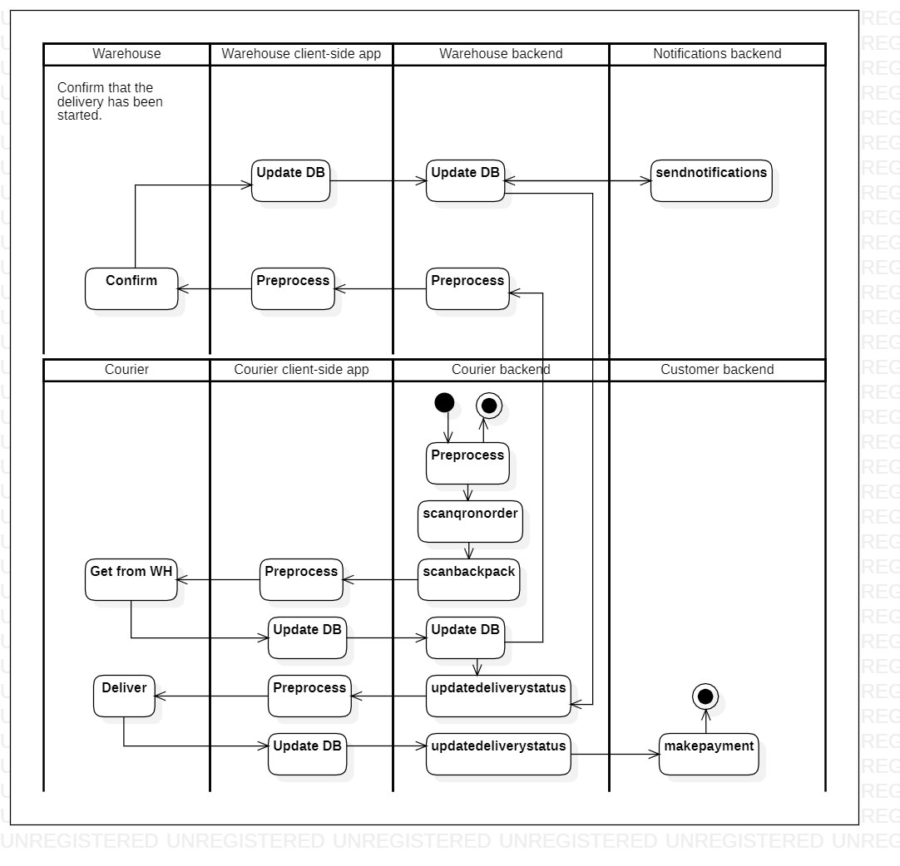

# deliverorder

[English](deliverorder.md) | [Русский](deliverorder.ru.md)

Клиентское приложение для курьера: доставка заказа потребителю.

Сценарий, отвечающий за доставку заказа клиенту курьерами, предполагает использование мобильного приложения или устройства с поддержкой GPS для навигации к местоположению клиента, своевременную и профессиональную доставку заказа и получение всех необходимых подписей или других доказательств доставки.

Макропроцесс: [delivering](../../macroprocesses/delivering.ru.md)

Ответственные модули: [клиентское приложение](../../frontend/courierclient.md), [бэкэнд-сервис](../../backend/courierbackend.md)

## Описание процесса

- Регистрация заказа потребителя с использованием QR-кода: начало/конец работы с заказом.
- Информация по заказам, которые несёт/нёс курьер (номер заказа, место доставки, фактическое/ориентировочное время доставки).
- Построение наиболее оптимального маршрута для доставки.
- Отображение местоположения курьера на карте.

### Пошаговое выполнение

- Курьер открывает приложение на своем устройстве.
- Курьер выбирает заказ доставки, над которым работает.
- Курьер регистрирует рюкзак и заказ, запуская процессы [scanbackpack](scanbackpack.ru.md) и [scanqronorder](scanqronorder.ru.md).
- Запускается процесс [updatedeliverystatus](updatedeliverystatus.ru.md) для того, чтобы начать доставку.
- Курьер перемещается к адресу доставки, используя функцию карты приложения.
- Курьер доставляет заказ покупателю и получает подпись или код подтверждения.
- Курьер отмечает в системе заказ на доставку как выполненный.
- Когда курьер отмечает заказ как выполненный, запускается процесс [updatedeliverystatus](updatedeliverystatus.ru.md) для того, чтобы закончить доставку.

