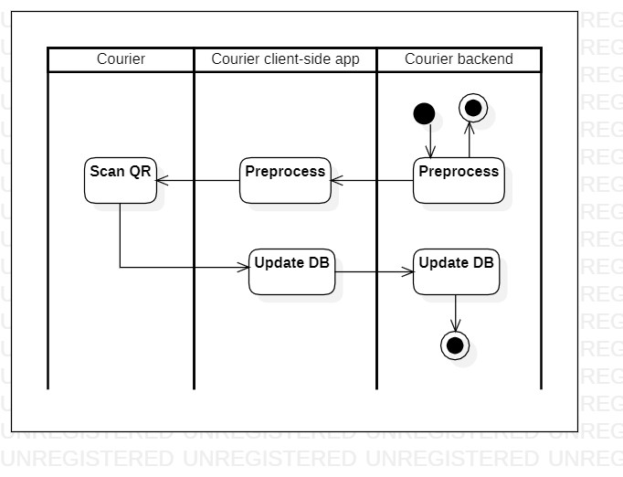
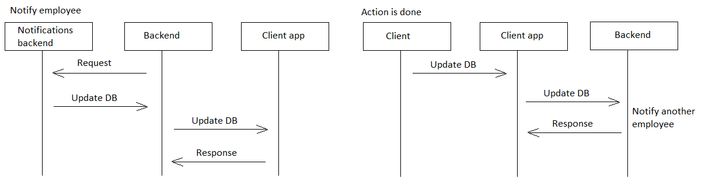

# scanbackpack

[English](scanbackpack.md) | [Русский](scanbackpack.ru.md)

Name: **Scan backpack QR code**.

The scenario responsible for scanning QR code on backpack before delivering by couriers involves using a mobile app or handheld scanner to scan a unique QR code associated with each courier's backpack. 
This verifies that the correct courier is making the delivery and provides real-time tracking information to the delivery service company and the customer.

Process pattern: [delivering](../../processpatterns/delivering.md)

Responsible modules: [client application](../../frontend/courierclient.md), [backend service](../../backend/courierbackend.md)

Platform version: v0.1

## Dependencies

### Depends on

| Backend service | Process |
| --- | ---- |
| [courierbackend](../../backend/courierbackend.md) | [deliverorder](../courier/deliverorder.md) |

## Process description

- Registration of a backpack by scanning a QR code (in order to register the beginning / end of work during the day and track the location of the courier in real time).

Despite the fact that this process belongs to the macroprocess [delivering](../../processpatterns/delivering.ru.md), the implementation of this process is similar to the processes included in the macroprocess [maintenance](../../processpatterns/maintenance.ru.md), in the context of user notification:

### Flowcharts for network communication

### Step-by-step execution plan of the process

- The courier opens the app on their device.
- The courier selects the delivery order they are working on.
- The courier scans the QR code on the backpack using their device's camera.
- The system verifies the QR code and confirms that it matches the delivery order.

### Sequence diagrams within the process

## Data structures

| Object | DTO | Database table |
| --- | ---- | --- |
| QRCode | - | - |
| Backpack | - | - |
| [Employee](https://github.com/alexeysp11/workflow-lib/blob/main/src/Models/Business/InformationSystem/Employee.cs) | - | - |
| Delivery | DeliveryDTO | - |
| - | BackpackScanDTO | - |

- QRCode
    - QRCode object could have properties like codeValue, expirationDate, etc. 
- Backpack
    - Backpack object could have properties like size, weight capacity, QR code, etc. 
- Delivery
    - References to product, employee (courier), backpack, starting point, destination.
- BackpackScanDTO
    - BackpackScanDTO could have properties like courierName, qrCodeValue, backpackSize, backpackWeightCapacity, etc.
- DeliveryDTO: contains information about the delivery, such as delivery address and expected delivery time
