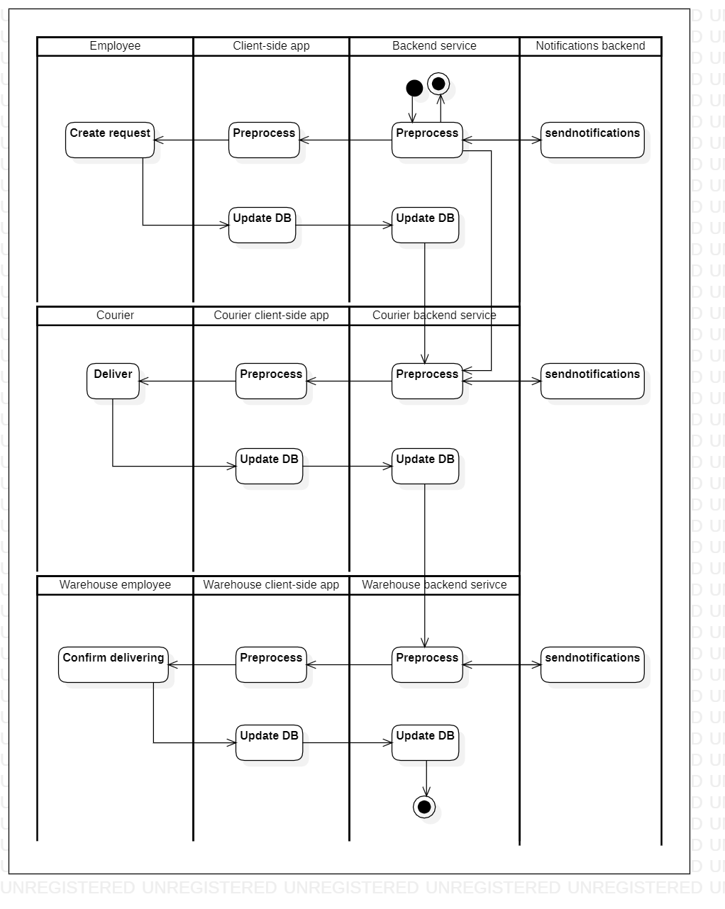

# store2wh

[English](store2wh.md) | [Русский](store2wh.ru.md)

Name: **Deliver order from store to WH**.

The scenario responsible for delivering products from store to warehouse by couriers involves receiving requests for specific products from warehouse employees, buying those products in the store, packaging them for transport, and delivering them to the warehouse in a timely manner.

Process pattern: [delivering](../../processpatterns/delivering.md)

Responsible modules: [client application](../../frontend/courierclient.md), [backend service](../../backend/courierbackend.md)

## Dependencies

### Depends on

| Backend service | Process |
| --- | ---- |
| [customerbackend](../../backend/customerbackend.md) | [preprocessorder](../customer/preprocessorder.md) |
| [warehousebackend](../../backend/warehousebackend.md) | [wh2kitchen](../warehouse/wh2kitchen.md) |
| [kitchenbackend](../../backend/kitchenbackend.md) | [requestingedients](../kitchen/requestingedients.md) |
| [managerbackend](../../backend/managerbackend.md) | [inventorylevels](../manager/inventorylevels.md) |

### Influences on

| Backend service | Process |
| --- | ---- |
| [notificationsbackend](../../backend/notificationsbackend.md) | [sendnotifications](../notificationsbackend/sendnotifications.md) |

## Process description

Nuances associated with the implementation of this backend service:
- When starting this process, the following must be passed as parameters, among others:
    - **backend service from which the process was launched**;
    - **backend service that will be launched from this process** (usually when designing external processes, it is recommended to return a response to the same backend service from which the dependent process was launched, but this parameter is a way to specify dependencies between microservices in a more explicit form);
    - **type of the corresponding client application** (by default, the one that corresponds to the backend service from which this process was launched is used);
    - **name and quantity of products that need to be purchased** (if the process is launched from [preprocessorder](../customer/preprocessorder.ru.md), then this parameter is required).
- The area of responsibility in which this process starts remains the same as that of the external backend service that called it.
- To simplify the design and development process at the initial stages, we proceed from the idea that the store with the optimal price-quality ratio has already been selected (for example, due to contracts concluded as part of the management of relations with contractors, or a predetermined address of the nearest store). This means that **the backend service does not need to calculate which store is more profitable to buy products from**; accordingly, **information about the store will be obtained from the database**.
- Building the most optimal delivery route and displaying the courier's location on a map is an important component of a real delivery service application, but **in this prototype application these functions are not currently implemented** in order to reduce the complexity of design and implementation.

This process provides the implementation of the [delivering](../../processpatterns/delivering.ru.md) process pattern:

### Step-by-step execution

- The backend service, in whose area of responsibility this process is launched, notifies the employee who launched the process about the need to clarify which products need to be delivered from the store (this action is performed only if the list of products for purchase is not filled in among the parameters).
- The employee creates a delivery order in the system: list of products, store (loaded automatically from the database).
- Information about orders transported by courier (order number, delivery location, actual/estimated delivery time).
- The notification comes to the backend service of the courier application.
- The system assigns a courier to the delivery order.
- The courier accepts the order for work.
- Building the most optimal delivery route.
- Displaying the courier's location on the map.
- The courier picks up the goods from the store and loads them into his car.
- The courier delivers the products to the warehouse.
- The courier marks the delivery order in the system as completed, and attaches a photo of the receipt as confirmation.

## Data structures

| Object | DTO | Database table |
| --- | ---- | --- |
| [Product](https://github.com/alexeysp11/workflow-lib/blob/main/src/Models/Business/Products/Product.cs) | - | - |
| [Employee](https://github.com/alexeysp11/workflow-lib/blob/main/src/Models/Business/InformationSystem/Employee.cs) | - | - |
| Store | - | - |
| [Warehouse](https://github.com/alexeysp11/workflow-lib/blob/main/src/Models/Business/InformationSystem/Warehouse.cs) | - | - |
| Delivery | DeliveryDTO | - |
| [DeliveryOrder](https://github.com/alexeysp11/workflow-lib/blob/main/src/Models/Business/BusinessDocuments/DeliveryOrder.cs) | - | - |

- The store object could have properties such as name, location, inventory, and staff. It could also have methods for managing inventory levels, scheduling staff, and processing orders.
- Warehouse object could have properties like location, inventory levels, etc. 
- Delivery: references to product, employee (courier), starting point, destination.
- DeliveryDTO could have properties like storeName, warehouseLocation, courierName, deliveryDate, vehicle type, etc.
