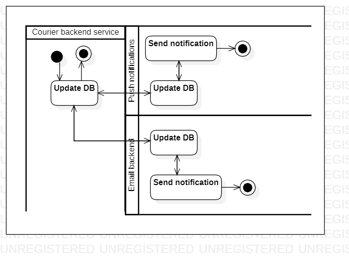

# updatedeliverystatus

[English](updatedeliverystatus.md) | [Русский](updatedeliverystatus.ru.md)

Наименование: **Обновление статуса доставки**.

Сценарий, отвечающий за обновление статуса заказа после доставки курьером, предполагает использование мобильного приложения или веб-интерфейса для обновления статуса заказа с "отправлен на доставку" на "доставлен" и предоставления любых соответствующих сведений о доставке.

Паттерн процесса: [delivering](../../processpatterns/delivering.ru.md)

Ответственные модули: [клиентское приложение](../../frontend/courierclient.md), [бэкэнд-сервис](../../backend/courierbackend.md)

## Зависимости

### Влияет на

| Бэкэнд-сервис | Процесс |
| --- | ---- |
| [notificationsbackend](../../backend/notificationsbackend.ru.md) | [sendnotifications](../notificationsbackend/sendnotifications.ru.md) |

## Описание процесса

### Пошаговое выполнение

- Курьер открывает приложение на своем устройстве.
- Курьер выбирает заказ доставки, над которым работает.
- Курьер обновляет статус заказа на доставку (например, "в пути", "доставлен") в системе.
- Система обновляет статус заказа на доставку и уведомляет клиента о любых изменениях.

