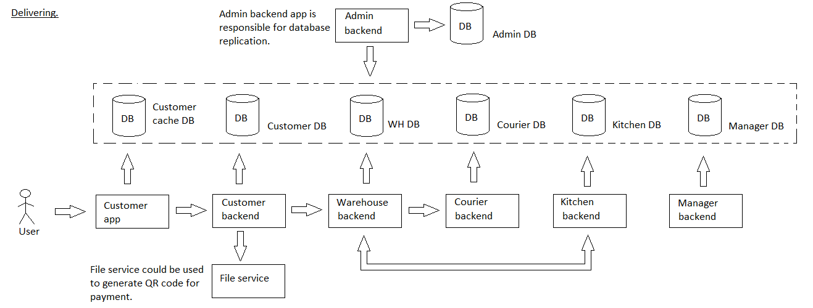

# cancelorder

Доступно на других языках: [English/Английский](cancelorder.md), [Russian/Русский](cancelorder.ru.md). 

Клиентское приложение для потребителя: отменить заказ.

Сценарий отмены заказа в приложении службы доставки позволяет клиентам отменить свой заказ до его подготовки и доставки.
Приложение предлагает пользователю подтвердить отмену и предоставляет возможность оставить отзыв или комментарий.

Связанные модули: [клиентское приложение](../../frontend/customerclient.md), [бэкенд-сервис](../../backend/customerbackend.md).

## Описание процесса

- Некоторые заказы не могут быть отменены: 
    - статус: 
       - "В доставке", 
       - "В готовке"; 
       - "Работник отдела WH начал свою работу" (внутренний фильтр, пользователь его никогда не видит);
       - "В доставке из магазина на склад" (внутренний фильтр, пользователь его никогда не видит).
    - вид оплаты: 
       - не "наличная при получении", 
       - не "через валидатор при получении".
- Если при загрузке карточки заказа уже известно, что заказ не может быть отменен, то скрывать кнопку "Отменить заказ".
- После отмены заказа, заказ пропадает из списка текущих заказов.

### Пошаговое выполнение

- Пользователь открывает страницу [Текущие заказы](pendingorders.ru.md) или [Все заказы](orders.ru.md).
- Пользователь выбирает заказ, который хочет отменить, или открывает страницу заказа.
- Пользователь нажимает кнопку "Отменить заказ".
- [Клиентское приложение](../../frontend/customerclient.ru.md) проверяет, можно ли отменить заказ.
    - Если заказ не может быть отменен, [клиентское приложение](../../frontend/customerclient.ru.md) выводит сообщение «Заказ не может быть отменен, поскольку заказ уже находится в доставке».
    - Если заказ можно отменить, [клиентское приложение](../../frontend/customerclient.ru.md) перенаправляет запрос в сервис [customerbackend](../../backend/customerbackend.ru.md).
- Сервис [customerbackend](../../backend/customerbackend.ru.md) проверяет, можно ли отменить заказ.
- Если статус заказа изменился или не позволяет отменить заказ, то обновить данные в БД, вывести сообщение "Заказ не может быть отменен из-за несоответствия статуса" и обновить статус заказа.
- Если статус заказа позволяет отменить заказ, то выполните следующие действия:
    - обновить данные в БД,
    - уведомить сервис [warehousebackend](../../backend/warehousebackend.ru.md),
    - уведомить сотрудника WH, ответственного за проверку количества ингредиентов, а также его руководителя,
    - вывести сообщение "Заказ успешно отменен",
    - обновить страницу.

## Данные

### Объекты 

- [Employee](https://github.com/alexeysp11/workflow-lib/blob/main/docs/Models/Business/InformationSystem/Employee.md)
- [Product](https://github.com/alexeysp11/workflow-lib/blob/main/docs/Models/Business/Products/Product.md)
- [ProductCategory](https://github.com/alexeysp11/workflow-lib/blob/main/docs/Models/Business/Products/ProductCategory.md)
- [DeliveryOrder](https://github.com/alexeysp11/workflow-lib/blob/main/docs/Models/Business/BusinessDocuments/DeliveryOrder.md)

### Таблицы в БД

- [delivery_employee_whb](../../dbtables/warehouse/delivery_employee_whb.md)
- [delivery_menuitem_cb](../../dbtables/customer/delivery_menuitem_cb.md)
- [delivery_category_cb](../../dbtables/customer/delivery_category_cb.md)
- [delivery_order_cb](../../dbtables/customer/delivery_order_cb.md)
