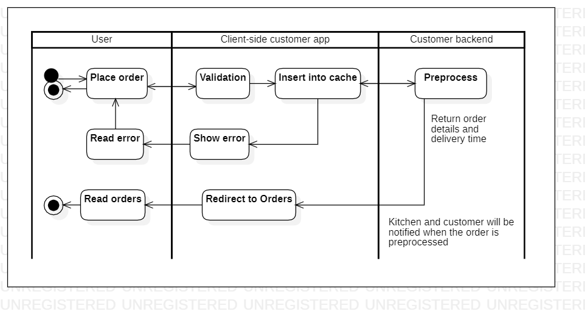

# customer.makeorder

Read this in other languages: [English](makeorder.md), [Russian/Русский](makeorder.ru.md). 

Customer client application: make order.

The description of the **client application** is presented at [this link](../../frontend/customerclient.md).

## Description of the process

- Displaying the menu:
    - Unloaded from the backend: categories (name, picture, description), individual items (name, picture, price, description).
- When placing an order: 
    - User enters: list of selected items from menu, size, quantity, place of delivery.
    - Calculated on the backend: total order amount, estimated cooking and delivery time.
- Use of predictive models: estimated cooking and delivery times.

### Step-by-step execution

- The user opens the order form.
- Select a category.
- Select a product, specify quantity and size.
- The user clicks "Continue".
- Filling out the form for delivery: delivery address, type of payment, delivery method (on foot, electric scooter, car).
    - Some information is preloaded from the database: the approximate duration of the trip to the store, cooking, delivery price.
    - After filling in the address for delivery, you can click "Calculate delivery time": a route is built on the background from the warehouse to the specified address and then the approximate delivery time is displayed.
    - When you change the delivery method, the price for delivery changes.
    - You can specify a warehouse as a delivery address.
- User clicks "Finish":
    - The information entered by the user is sent to the database and to [customerbackend](../../backend/customerbackend.md), which also notifies [kitchenbackend](../../backend/kitchenbackend.md ).
    - Add payment geteway after filling out the form if a card is selected as a type of payment.
    - All selected products are stored on the frontend side until the user clicks "Finish checkout".
- The user is on the "Pending orders" page.

## Objects 

- [Product](https://github.com/alexeysp11/workflow-lib/blob/main/docs/Models/Business/Products/Product.md)
- [ProductCategory](https://github.com/alexeysp11/workflow-lib/blob/main/docs/Models/Business/Products/ProductCategory.md)
- [DeliveryOrder](https://github.com/alexeysp11/workflow-lib/blob/main/docs/Models/Business/BusinessDocuments/DeliveryOrder.md)
- [PlaceOrderModel](../../classes/models/Orders/PlaceOrderModel.md)
