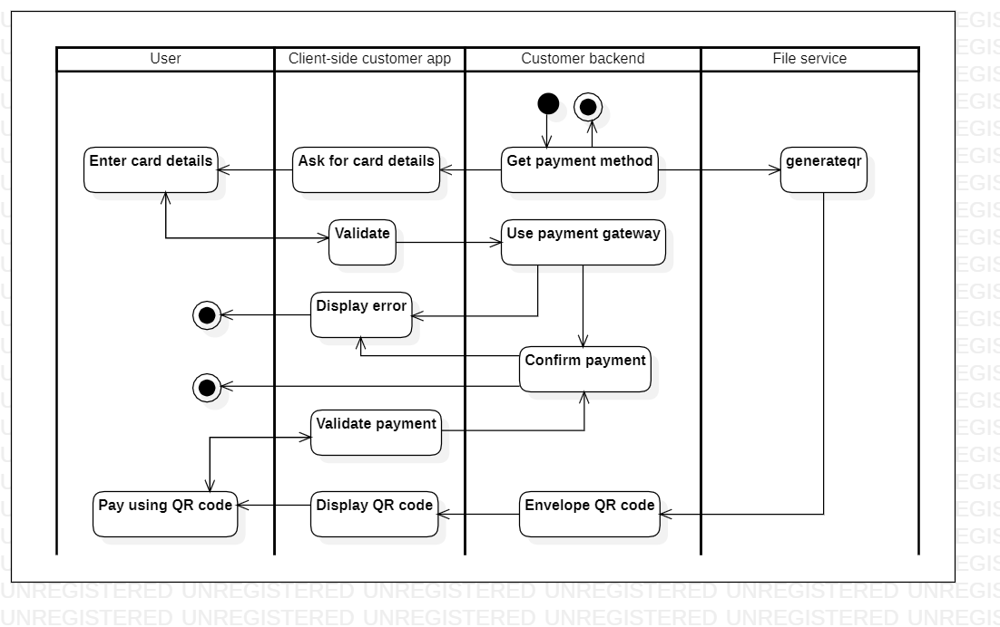
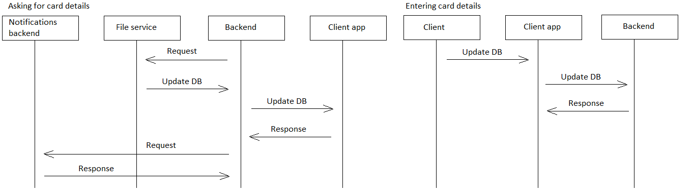

# makepayment 

[English](makepayment.md) | [Русский](makepayment.ru.md)

Name: **Make a payment**.

The payment scenario in the delivery service app involves a user selecting a payment method and providing their payment information to complete the transaction for their order. 
The app securely processes the payment and provides confirmation of the successful transaction.

Process pattern: [delivering](../../processpatterns/delivering.md)

Responsible modules: [client application](../../frontend/customerclient.md), [backend service](../../backend/customerbackend.md)

Platform version: v0.1

## Dependencies

### Depends on

| Backend service | Process |
| --- | ---- |
| [customerbackend](../../backend/customerbackend.md) | [makeorder](../customer/makeorder.md) |
| [courierbackend](../../backend/courierbackend.md) | [deliverorder](../courier/deliverorder.md) |

### Influences on

| Backend service | Process |
| --- | ---- |
| [fileservice](../../backend/fileservice.md) | [generateqr](../fileservice/generateqr.md) |

## Process description

- The [customer app](../../frontend/customerclient.md) allows users to make payments for their orders using different payment methods.
- Responsible for payment of the order.
- Called within the [makeorder](../customer/makeorder.md) or after the [deliverorder](../courier/deliverorder.md) process.

### Flowcharts for network communication

### Step-by-step execution plan of the process

- When the customer places their order, they need to select their preferred payment method (see [makeorder](../customer/makeorder.md)).
- If they choose **cash on delivery**, they confirm the order and pay the courier when they receive their order.
- If they choose **POS when receiving**, they confirm the order and pay using their credit or debit card when they receive the order.
- If they choose **using QR code**, they scan the QR code provided by the app and confirm the payment.
    - The [customer backend service](../../backend/customerbackend.md) sends a request to [fileservice](../../backend/fileservice.md) to generate a QR code for payment.
- If they choose **using CVC**, they enter their card details and confirm the payment.
    - Add payment geteway after filling out the form if a card is selected as a type of payment.
- The app confirms the payment and sends to the backend service.

### Sequence diagrams within the process

## Data structures

### Objects 

- [DeliveryOrder](https://github.com/alexeysp11/workflow-lib/blob/main/src/Models/Business/BusinessDocuments/DeliveryOrder.cs)
- [Customer](https://github.com/alexeysp11/workflow-lib/blob/main/src/Models/Business/Customers/Customer.cs)
- Delivery
- [Payment](https://github.com/alexeysp11/workflow-lib/blob/main/src/Models/Business/Monetary/Payment.cs)
- Transaction
    - Transaction contains information about the payment transaction, such as transaction ID and status

### DTOs 

- OrderDTO
- CustomerDTO
- DeliveryDTO
- PaymentDTO: contains information about the payment, such as payment method and total amount
- TransactionDTO: contains information about the payment transaction, such as transaction ID and status

### DB tables 

- deliveries: contains columns for delivery ID, delivery address, expected delivery time, and status
- payments: contains columns for payment ID, payment method, total amount, and status
- transactions: contains columns for transaction ID, payment ID, status, and timestamp
