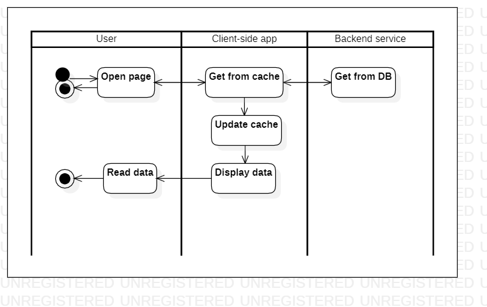

# pendingorders

Доступно на других языках: [English/Английский](pendingorders.md), [Russian/Русский](pendingorders.ru.md). 

Клиентское приложение для потребителя: текущие заказы.

Общее описание сценария отслеживания заказа в серверной службе клиентов заключается в том, что он позволяет клиентам отслеживать ход выполнения их заказа от обработки до доставки.

Интерактивные шаги в рамках сценария включают просмотр обновлений статуса заказа в режиме реального времени, отслеживание местоположения курьера на карте и получение уведомлений, когда заказ готов к доставке или уже доставлен.

Связанные модули: [клиентское приложение](../../frontend/customerclient.md), [бэкенд-сервис](../../backend/customerbackend.md).

## Описание процесса

Данный процесс почти полностью повторяет [просмотр всех заказов](orders.ru.md), за исключением того, что для отображения на данной форме заказы фильтруются по статусу: необходимо, чтобы было "Обрабатывается", "В процессе готовки", "В доставке".

## Данные

### Объекты 

- [Product](https://github.com/alexeysp11/workflow-lib/blob/main/docs/Models/Business/Products/Product.md)
- [ProductCategory](https://github.com/alexeysp11/workflow-lib/blob/main/docs/Models/Business/Products/ProductCategory.md)
- [DeliveryOrder](https://github.com/alexeysp11/workflow-lib/blob/main/docs/Models/Business/BusinessDocuments/DeliveryOrder.md)

### Таблицы в БД

- [delivery_menuitem_cb](../../dbtables/customer/delivery_menuitem_cb.md)
- [delivery_category_cb](../../dbtables/customer/delivery_category_cb.md)
- [delivery_order_cb](../../dbtables/customer/delivery_order_cb.md)