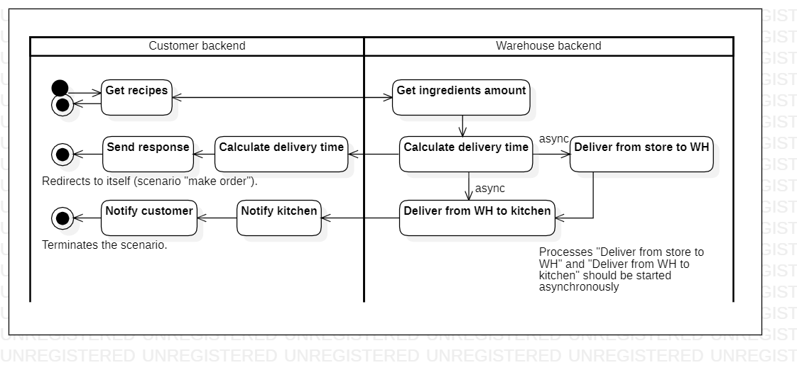
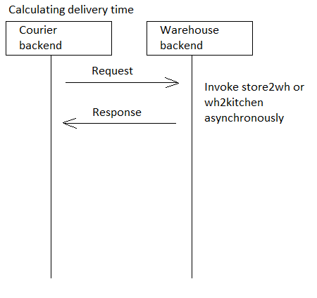

# preprocessorder

[English](preprocessorder.md) | [Русский](preprocessorder.ru.md)

Наименование: **Предварительная обработка заказа**.

Сценарий предобработки заказа в приложении службы доставки предполагает получение рецептов из базы данных, расчет необходимого и фактического количества ингредиентов, асинхронный вызов процессов доставки ингредиентов на кухню или продукции из магазина на склад.
На основе этих расчетов приложение определяет примерное время доставки заказа.

Паттерн процесса: [delivering](../../processpatterns/delivering.ru.md)

Ответственные модули: [бэкэнд-сервис](../../backend/customerbackend.md)

Версия платформы: v0.1

## Зависимости

### Зависит от

| Бэкэнд-сервис | Процесс |
| --- | ---- |
| [customerbackend](../../backend/customerbackend.ru.md) | [makeorder](../customer/makeorder.ru.md) |

### Влияет на

| Бэкэнд-сервис | Процесс |
| --- | ---- |
| [warehousebackend](../../backend/warehousebackend.ru.md) | [wh2kitchen](../warehouse/wh2kitchen.ru.md) |
| [warehousebackend](../../backend/warehousebackend.ru.md) | [kitchen2wh](../warehouse/kitchen2wh.ru.md) |
| [kitchenbackend](../../backend/kitchenbackend.ru.md) | [preparemeal](../kitchen/preparemeal.ru.md) |
| [courierbackend](../../backend/courierbackend.ru.md) | [store2wh](../courier/store2wh.ru.md) |
| [courierbackend](../../backend/courierbackend.ru.md) | [deliverorder](../courier/deliverorder.ru.md) |

## Описание процесса

- [Приложение службы доставки](../../../README.ru.md) включает сценарий, который предварительно обрабатывает заказ перед его отправкой на кухню для приготовления.
- Выполняется автоматически в рамках процесса [makeorder](../customer/makeorder.ru.md).
- Задействованые бэкенд-сервисы: [customerbackend](../../backend/customerbackend.ru.md), [warehousebackend](../../backend/warehousebackend.ru.md), [kitchenbackend](../../backend/kitchenbackend.ru.md), [courierbackend](../../backend/courierbackend.ru.md).
- В БД есть таблицы [delivery_recipe_cb](../../dbtables/customer/delivery_recipe_cb.md), [delivery_ingredient_cb](../../dbtables/customer/delivery_ingredient_cb.md) и [delivery_menuitem_cb](../../dbtables/customer/delivery_menuitem_cb.md), которая содержит рецепты каждого продукта с указанием необходимых исходных продуктов и их количеством/весом/объемом. Рецепты необходимы для того, чтобы на их основе можно было получить количество исходных продуктов, необходимых для выполнения заказа.
    - Данные из этих таблиц попадают из БД, относящейся к сервису [managerbackend](../../backend/managerbackend.ru.md), с помощью механизма репликации.
- В БД есть таблица [delivery_whproduct_whb](../../dbtables/warehouse/customer/delivery_whproduct_whb.md), в которой хранятся данные по продуктам на складе в текущий момент времени.

### Пошаговое выполнение

- Сервис получает запрос, включающий параметры заказа, которые сформированы клиентом (заказ представлен в виде объекта [DeliveryOrder](https://github.com/alexeysp11/workflow-lib/blob/main/src/Models/Business/BusinessDocuments/DeliveryOrder.cs)).
- В БД выполняется запрос на получение реального количества необходимых исходных продуктов на складе.
- Если **количества** на складе **не достаточно**, то асинхронно запускается процесс [Доставить из магазина на склад](../courier/store2wh.ru.md), и отправляется ответ на сервис, который вызвал данный процесс.
- Если **количества** на складе **достаточно**, то асинхронно запускается процесс [Доставить со склада на кухню](../warehouse/wh2kitchen.ru.md), и отправляется ответ на сервис, который вызвал данный процесс.

### Диаграммы последовательности

Фактически выполнение данного процесса с точки зрения HTTP-запросов ограничивается получением данных об ориентировочном времени доставки заказа. 

Согласно пошаговому выполнению, данный запрос должен сохранять информацию о последовательности вызываемых процессов (это сделано для удобства проектирования и понимания системы). 
Однако фактически данный процесс обновляется внутри HTTP-запросов, выполняющихся в рамках дочерних процессов.

Например, после приготовления заказа и его передачи на склад, согласно диаграмме пошагового выполнения, вызывается процесс [sendnotifications](../notificationsbackend/sendnotifications.ru.md) (см. также диаграмму последовательности процесса [getnotified](../notificationsbackend/getnotified.ru.md)).

## Структуры данных

| Объект | DTO | Таблица в БД |
| --- | ---- | --- |
| [Employee](https://github.com/alexeysp11/workflow-lib/blob/main/src/Models/Business/InformationSystem/Employee.cs) | EmployeeDTO | [delivery_employee_whb](../../dbtables/warehouse/delivery_employee_whb.md) |
| [UserAccount](https://github.com/alexeysp11/workflow-lib/blob/main/src/Models/Business/InformationSystem/UserAccount.cs) | UserAccountDTO | [delivery_useraccount_whb](../../dbtables/warehouse/delivery_useraccount_whb.md) |
| [Ingredient](https://github.com/alexeysp11/workflow-lib/blob/main/src/Models/Business/Products/Ingredient.cs) | IngredientDTO | [delivery_ingredient_cb](../../dbtables/customer/delivery_ingredient_cb.md) |
| [Product](https://github.com/alexeysp11/workflow-lib/blob/main/src/Models/Business/Products/Product.cs) | ProductDTO | [delivery_menuitem_cb](../../dbtables/customer/delivery_menuitem_cb.md) |
| [Recipe](https://github.com/alexeysp11/workflow-lib/blob/main/src/Models/Business/Products/Recipe.cs) | RecipeDTO | [delivery_recipe_cb](../../dbtables/customer/delivery_recipe_cb.md) |
| [WHProduct](https://github.com/alexeysp11/workflow-lib/blob/main/src/Models/Business/Products/WHProduct.cs) | WHProductDTO | [delivery_whproduct_whb](../../dbtables/warehouse/delivery_whproduct_whb.md) |
