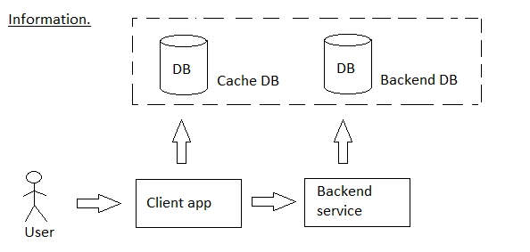
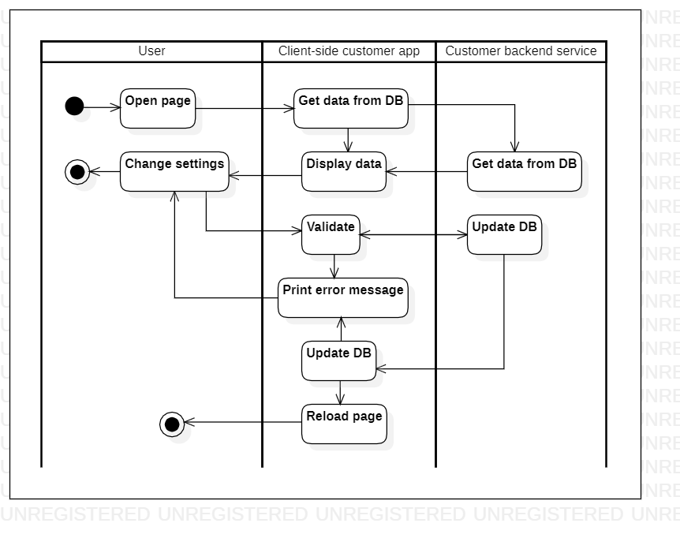

# settings 

[English](settings.md) | [Русский](settings.ru.md)

Name: **Settings**.

The personal settings scenario in the customer client app involves allowing users to view and edit their personal information, such as name, email address, and payment methods. 
The app securely stores this information and allows users to update it as needed.

Process pattern: [information](../../processpatterns/information.md)

Responsible modules: [client application](../../frontend/customerclient.md), [backend service](../../backend/customerbackend.md)

## Process description

Settings and personal data page:
- Personal information:
    - login (saved in [ClaimsPrincipal](https://learn.microsoft.com/en-us/dotnet/api/system.security.claims.claimsprincipal), see [useraccount](../systembackend/useraccount.md)),
    - email (saved in [ClaimsPrincipal](https://learn.microsoft.com/en-us/dotnet/api/system.security.claims.claimsprincipal), see [useraccount](../systembackend/useraccount.md)),
    - phone (saved in [ClaimsPrincipal](https://learn.microsoft.com/en-us/dotnet/api/system.security.claims.claimsprincipal), see [useraccount](../systembackend/useraccount.md)),
    - connected messengers: WhatsApp, Viber, Telegram,
    - nickname in Telegram,
    - preferred method of communication: e-mail, phone, one of the messengers,
- Payment:
    - preferred payment method,
    - linked cards.
- Usability:
    - default delivery location.
- Safety:
    - password (this parameter is empty by default).

You can also go to [user account](../systembackend/useraccount.md) to see some personal settings.

### Step-by-step execution

- The user opens "Settings".
- Some parameters are loaded from the [user account](../systembackend/useraccount.md) page, and some paraters are loaded from the database or [backend service](../../backend/customerbackend.md).
- The user changes settings.
- At the bottom of the page there is a button "Save changes".
    - Changes get to the services, after the response from the service - to the database.
    - After that, the user is shown on the interface: "Successful" or "An error occurred".

## Data structures

### Objects 

- [Customer](https://github.com/alexeysp11/workflow-lib/blob/main/src/Models/Business/Customers/Customer.cs)
- [Contact](https://github.com/alexeysp11/workflow-lib/blob/main/src/Models/Business/Customers/Contact.cs)
- [Address](https://github.com/alexeysp11/workflow-lib/blob/main/src/Models/Business/Address.cs)
- PaymentMethod
- Card

### DTOs 

- UserDTO, 
- PaymentMethodDTO, 
- CardDTO
