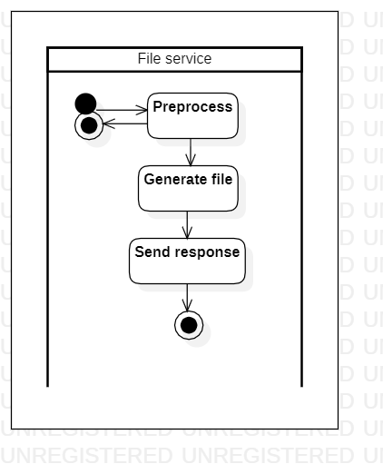

# generateqr

[English](generateqr.md) | [Русский](generateqr.ru.md)

Name: **Generate QR code**.

The scenario responsible for generating QR codes in the delivery service company involves creating unique codes for each order or package to enable tracking and verification. 

Process pattern: [transmittingfile](../../processpatterns/transmittingfile.md)

Responsible modules: [backend service](../../backend/fileservice.md)

Platform version: v0.1

## Dependencies

### Depends on

| Backend service | Process |
| --- | ---- |
| [customerbackend](../../backend/customerbackend.md) | [makepayment](../../flowchartsteps/delivering/makepayment.md) |

## Process description

### Step-by-step execution plan of the process

- The request goes to the backend service [fileservice](../../backend/fileservice.ru.md).
- The request is being processed for errors.
- The file is being generated.
- The file is sent as a response to the request.

## Data structures

### Objects 

- The QR code model could include properties such as code content and formatting. 
- The verification service could include methods for scanning and verifying QR codes.
