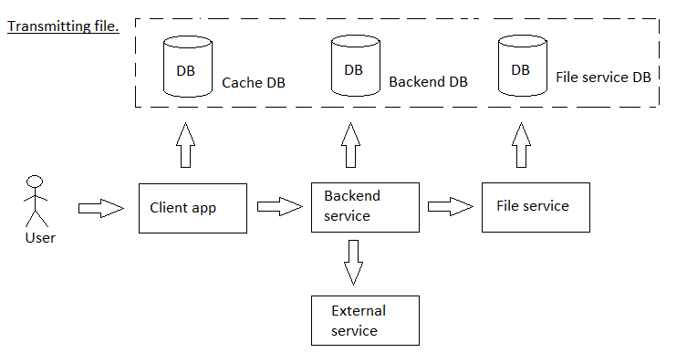

# watchingvideos

[English](watchingvideos.md) | [Русский](watchingvideos.ru.md)

Name: **Watching videos**.

The watch videos scenario in the delivery service app involves allowing users to access and watch videos either downloaded from the app's backend service or retrieved from YouTube.

Process pattern: [transmittingfile](../../processpatterns/transmittingfile.md)

Responsible modules: [client application](../../frontend/customerclient.md), [backend service](../../backend/customerbackend.md)

## Process description

The overall strategy of delivering video from file service to the web browser involves the client side app sending a request to the backend service, which redirects the request to the file service where the video is stored. 
The file service then streams the video to the backend service, which in turn sends it to the web browser for playback. 
This process involves the use of network protocols and caching to ensure smooth playback and minimize buffering.

The video is not stored on the frontend, but rather streamed from the backend service to the web browser for playback. 
Data stored on the frontend can be cleared using various methods such as clearing browser cache or using JavaScript to clear specific data.

Network protocols that could be used to transmit videos in the delivery service app include HTTP, RTMP, HLS, and MPEG-DASH. 
The choice of protocol depends on factors such as video quality, device compatibility, and network conditions.

The main difference between the strategy of transmitting static videos and live streaming in terms of system design is that static videos can be preloaded and cached on the client side, while live streaming requires a continuous stream of data from the server to the client. 
Live streaming also requires a more robust infrastructure to handle real-time data transmission and ensure smooth playback.

The live streaming strategy could be used to transmit static videos, but it may not be the most efficient solution as it involves continuous data transmission even when the video is not being played. 
Preloading and caching static videos on the client side may be a more efficient solution.

### Step-by-step execution

- User selects a video to watch.
- The system checks if the video is available in the backend service.
- If the video is available, the system streams it to the user's device.
    - The process interacts with the [file service](../../backend/fileservice.md).
- If the video is not available in the backend service, the system retrieves it from YouTube.
- The system streams the video from YouTube to the user's device.

## Data structures

### Objects

- Video
    - Video object could have properties like title, description, length, genre, etc. 
- [Customer](https://github.com/alexeysp11/workflow-lib/blob/main/src/Models/Business/Customers/Customer.cs)
- WatchedVideo
    - WatchedVideo object could have a reference to the Video object and properties like date watched, watch duration, etc. 

### DTOs

- WatchedVideoDTO
    - WatchedVideoDTO could have properties like videoId, dateWatched, watchDuration, etc.
