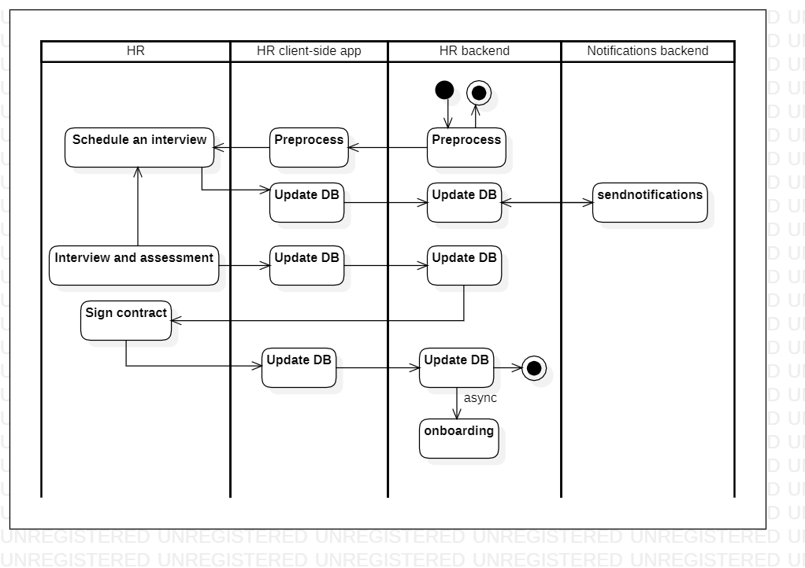

# candidateselection

[English](candidateselection.md) | [Русский](candidateselection.ru.md)

Наименование: **Подбор кандидата**.

Процесс отбора кандидатов включает в себя проверку, отбор и наем кандидатов на различные роли в приложении службы доставки с упором на использование методов, основанных на данных, для принятия обоснованных решений о найме.

Паттерн процесса: [maintenance](../../processpatterns/maintenance.ru.md)

Ответственные модули: [клиентское приложение](../../frontend/hrclient.ru.md), [бэкенд-сервис](../../backend/hrbackend.ru.md)

## Зависимости

### Зависит от

| Бэкэнд-сервис | Процесс |
| --- | ---- |
| [managerbackend](../../backend/managerbackend.ru.md) | [startemployeesearch](../manager/startemployeesearch.ru.md) |

### Влияет на

| Бэкэнд-сервис | Процесс |
| --- | ---- |
| [notificationsbackend](../../backend/notificationsbackend.ru.md) | [sendnotifications](../notificationsbackend/sendnotifications.ru.md) |
| [hrbackend](../../backend/hrbackend.ru.md) | [onboarding](../hr/onboarding.ru.md) |

## Описание процесса

Методы отбора кандидатов:
- Проверка анкетных данных,
- Проверка резюме,
- Проверка сопроводительного письма,
- Форма заявления,
- Видеопоказ,
- Проверка посредством телефонных звонков,
- Предварительные оценочные тесты,
- Личностные тесты,
- Письменные тесты,
- Личные интервью.

Для оценки кандидатов можно использовать Short-listing matrix.

Этапы отборочного процесса:
- Выявление потребности в персонале,
- Составление плана подбора персонала,
- Настройка рекламы,
- Приложение,
- Отбор и предварительный отбор,
- Интервью,
- Оценка,
- Рекомендации и проверка биографических данных,
- Решение,
- Предложение о работе и договор,
- Онбординг.

### Пошаговое выполнение

- На бэкэнд-сервис приходит запрос на заведение нового кандидата (в качестве параметров: персональная информация, анкета, резюме, сопроводительное письмо, заявление, предварительные тесты, заметки от HR).
- Вся информация валидируется и сохраняется.
- Если HR захочет посмотреть информацию по процессу отбора для конкретного кандидата, он/она легко может это сделать, выполнив переход из родительского процесса в данный процесс по ссылке.
- После заведения кандидата в системе, HR назначает собеседование с кандидатом, и уведомляются все заинтересованные сотрудники (список заинтеерсованных сотрудников передаётся в качестве параметра при инициализации процесса).
- Заинтересованные сотрудники подтверждают своё присутствие на собеседовании. 
- Проведение первичных собеседований по заранее определенным критериям.
- После собеседования HR получает обратную связь от менеджеров, которые проводили собеседование, и выставляет оценку кандидату в системе.
- На основании оценки, принимается решение о найме специалиста.
- В случае положительного решения о приёме кандидата на работу, HR сообщает решение кандидату, уточняет дату выхода на работу и отправляет ему оффер.
- Кандидат подписывает трудовой договор, и с этого момента запускается процесс онбординга (все подписанные документы сканируются и прикрепляются к личному делу сотрудника). 

