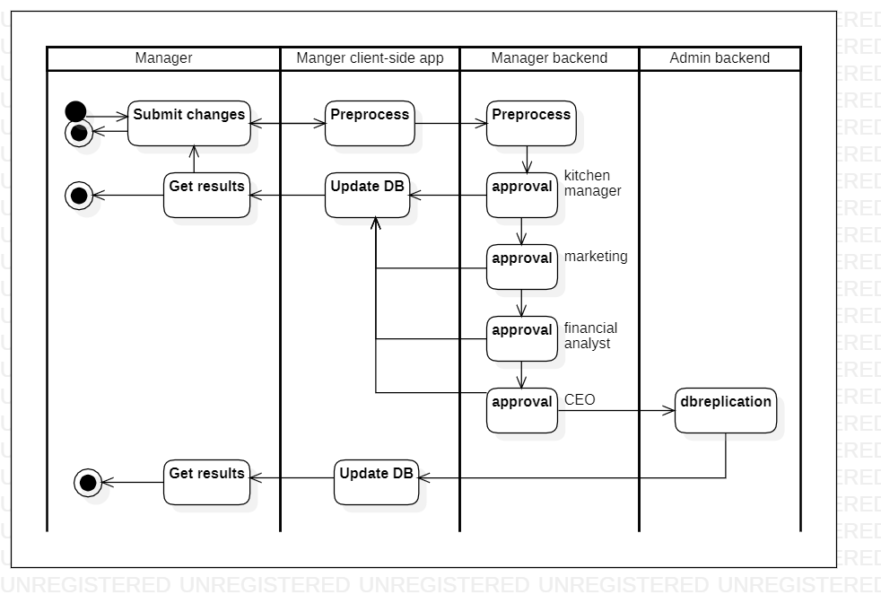

# changemenu

[English](changemenu.md) | [Русский](changemenu.ru.md)

Name: **Change menu**.

A scenario for changing a menu in a delivery service application involves getting information about the current menu status from the database, including and excluding products from the menu, and a chain of approval for changes (for example, *kitchen manager*, *marketing*, *financial analyst*, *CEO*).
A necessary condition when changing the menu is to set the date and time when the changes will become relevant.

If the negotiation is successful, the application updates the menu and notifies the other microservices of the platform about the changes that have occurred.

Process pattern: [requesting](../../processpatterns/requesting.md)

Responsible modules: [client application](../../frontend/kitchenclient.md), [backend service](../../backend/kitchenbackend.md)

## Dependencies

### Influences on

| Backend service | Process |
| --- | ---- |
| [managerbackend](../../backend/managerbackend.md) | [approval](../manager/approval.md) |
| [adminbackend](../../backend/adminbackend.md) | [dbreplication](../admin/dbreplication.md) |

## Process description

### Step-by-step execution

- Employee or manager logs into the app and navigates to the "Menu Management" section
- User selects the item to be modified or adds a new item to the menu
- App provides options to edit item details, such as name, description, price, and availability
- User submits the changes
- App updates the menu database with the modifications
- App notifies relevant staff members about the changes

