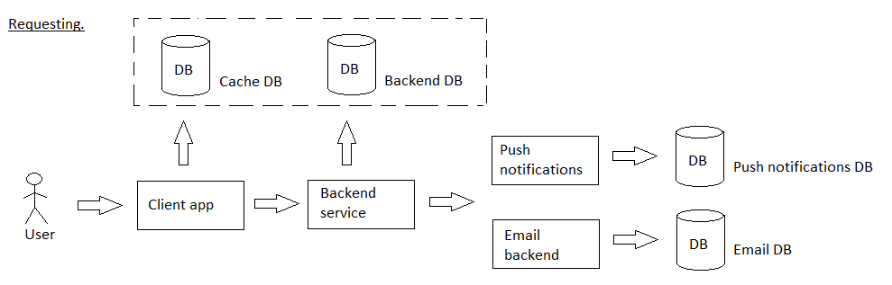

# changemenu

[English](changemenu.md) | [Русский](changemenu.ru.md)

Наименование: **изменение меню**.

Сценарий изменения меню в приложении службы доставки включает в себя получение сведений об актуальном состоянии меню из базы данных, включение и исключение продуктов из меню, а также цепочку согласования изменений (например, *менеджер кухни*, *маркетолог*, *финансовый аналитик*, *генеральный директор*).
Необходимым условием при изменении меню является установка даты и времени, когда изменения станут актуальными.

В случае успешного согласования приложение обновляет меню и уведомляет остальные микросервисы платформы о произошедших изменениях.

Макропроцесс: [requesting](../../macroprocesses/requesting.md)

Ответственные модули: [клиентское приложение](../../frontend/kitchenclient.md), [бэкэнд-сервис](../../backend/kitchenbackend.md)

## Описание процесса

