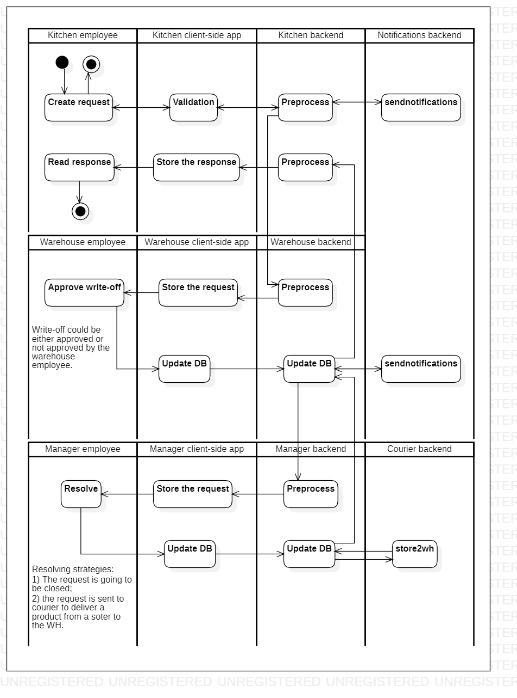

# requestingedients

[English](requestingedients.md) | [Русский](requestingedients.ru.md)

Наименование: **Запросить ингридиенты**.

Сценарий запроса ингридиентов в приложении службы доставки позволяет сотрудникам кухни запрашивать дополнительные или недостающие ингриденты по мере необходимости для выполнения входящих заказов.
Приложение отправляет эти запросы на склад или в другие соответствующие отделы для выполнения.

Паттерн процесса: [requesting](../../processpatterns/requesting.md)

Ответственные модули: [клиентское приложение](../../frontend/kitchenclient.md), [бэкэнд-сервис](../../backend/kitchenbackend.md)

## Зависимости

### Влияет на

| Бэкэнд-сервис | Процесс |
| --- | ---- |
| [notificationsbackend](../../backend/notificationsbackend.ru.md) | [sendnotifications](../notificationsbackend/sendnotifications.ru.md) |
| [courierbackend](../../backend/courierbackend.ru.md) | [store2wh](../courier/store2wh.ru.md) |

## Описание процесса

### Пошаговое выполнение

- Сотрудник кухни входит в приложение и переходит в раздел «Запрос ингредиентов».
- Сотрудник выбирает необходимые ингредиенты из заранее заданного списка или направляет запрос.
- Применение общей формы запроса с выбранными ингредиентами и количествами.
- Сотрудник отправляет форму запроса.
- Отправляется запрос контролеру запасов на утверждение списания.
- Менеджер рассматривает и подает заявку
- Утвержденный запрос запускает базовое обновление уровней запасов и уведомляет сотрудника.

