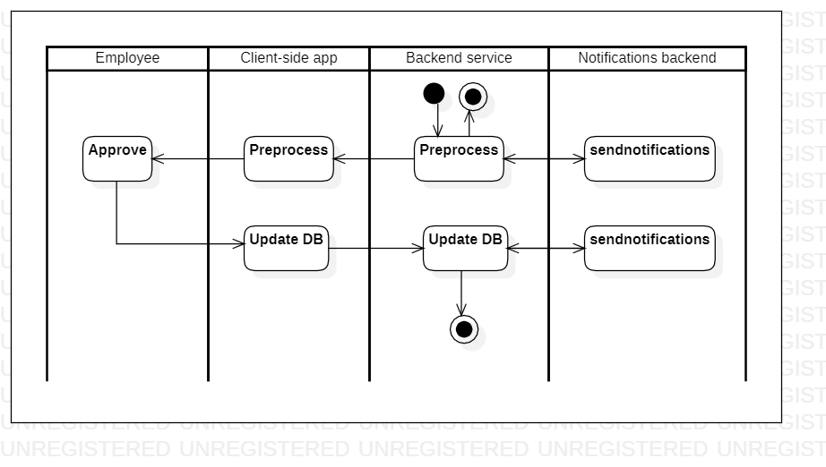

# approval

[English](approval.md) | [Русский](approval.ru.md)

Наименование: **Согласование**.

Сценарий, отвечающий за обеспечение атомарного действия в цепочке согласования со стороны выбранного менеджера. 

Паттерн процесса: [maintenance](../../processpatterns/maintenance.ru.md)

Ответственные модули: [клиентское приложение](../../frontend/managerclient.ru.md), [бэкенд-сервис](../../backend/managerbackend.ru.md)

Версия платформы: v0.1

## Зависимости

### Зависит от

| Бэкэнд-сервис | Процесс |
| --- | ---- |
| [managerbackend](../../backend/managerbackend.ru.md) | [changeproductprice](../manager/changeproductprice.ru.md) |
| [managerbackend](../../backend/managerbackend.ru.md) | [startemployeesearch](../manager/startemployeesearch.ru.md) |
| [kitchenbackend](../../backend/kitchenbackend.ru.md) | [changemenu](../kitchen/changemenu.ru.md) |
| [kitchenbackend](../../backend/kitchenbackend.ru.md) | [changerecipe](../kitchen/changerecipe.ru.md) |

### Влияет на

| Бэкэнд-сервис | Процесс |
| --- | ---- |
| [notificationsbackend](../../backend/notificationsbackend.ru.md) | [sendnotifications](../notificationsbackend/sendnotifications.ru.md) |

## Описание процесса

В качестве входных параметров помимо всего прочего в данный процесс передаются следующие: 
- Запрашивающий и согласующий (ссылки на аккаунт),
- Информация по процессу, который необходимо согласовать,
- Комментарий со стороны запрашивающего,
- Ссылка на процесс, куда нужно будет перенаправлять результат согласования,
- Список сотрудников, которые должны быть уведомлены о решении,
- Параметр, который показывает в каком случае необходимо уведомлять о решении (во всех случаях, только при отказе, только при утверждении, ни при каких случаях).

### План пошагового выполнения процесса

- Запрос приходит на бэкэнд-сервис, обеспечивающий работу специалиста, который должен провести согласование.
- Специалист уведомляется с помощью [notificationsbackend](../../backend/notificationsbackend.ru.md).
- Запрос отправлен на клиентское приложение, где сохраняется в БД.
- Сотрудник заходит вприложение и согласовывает или не согласовывает запрос.
- Результаты согласования сохраняются на клиентском приложении и на бэкэнд-сервисе.
- При необходимости уведомляются сотрудники, которые указаны в списке для уведомления.

