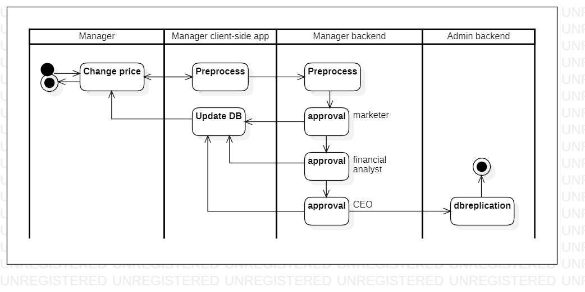

# changeproductprice

[English](changeproductprice.md) | [Русский](changeproductprice.ru.md)

Наименование: **Изменить цены на продукты**.

Сценарий, который ответственен за выставление цены на продукцию. 
Данный сценарий используется, по большей части, менеджерами компании.

Для данного сценария необходимо выполнения цепочки согласования (например, *маркетолог*, *финансовый аналитик*, *генеральный директор*).

Паттерн процесса: [requesting](../../processpatterns/requesting.ru.md)

Ответственные модули: [клиентское приложение](../../frontend/managerclient.md), [бэкэнд-сервис](../../backend/managerbackend.md).

Версия платформы: v0.1

## Зависимости

### Влияет на

| Бэкэнд-сервис | Процесс |
| --- | ---- |
| [managerbackend](../../backend/managerbackend.ru.md) | [approval](../manager/approval.ru.md) |
| [adminbackend](../../backend/adminbackend.ru.md) | [dbreplication](../admin/dbreplication.ru.md) |

## Описание процесса

### Пошаговое выполнение

- Менеджер авторизуется в приложении и переходит в раздел «Цены на продукцию».
- Менеджер выбирает товар, цену которого необходимо изменить
- Приложение предоставляет возможность ввести новую цену и причину изменения.
- Менеджер отправляет заявку на изменение цены
- Приложение обновляет базу данных цен на продукты, добавляя новую цену.
- Приложение уведомляет соответствующих сотрудников об изменении цен.

