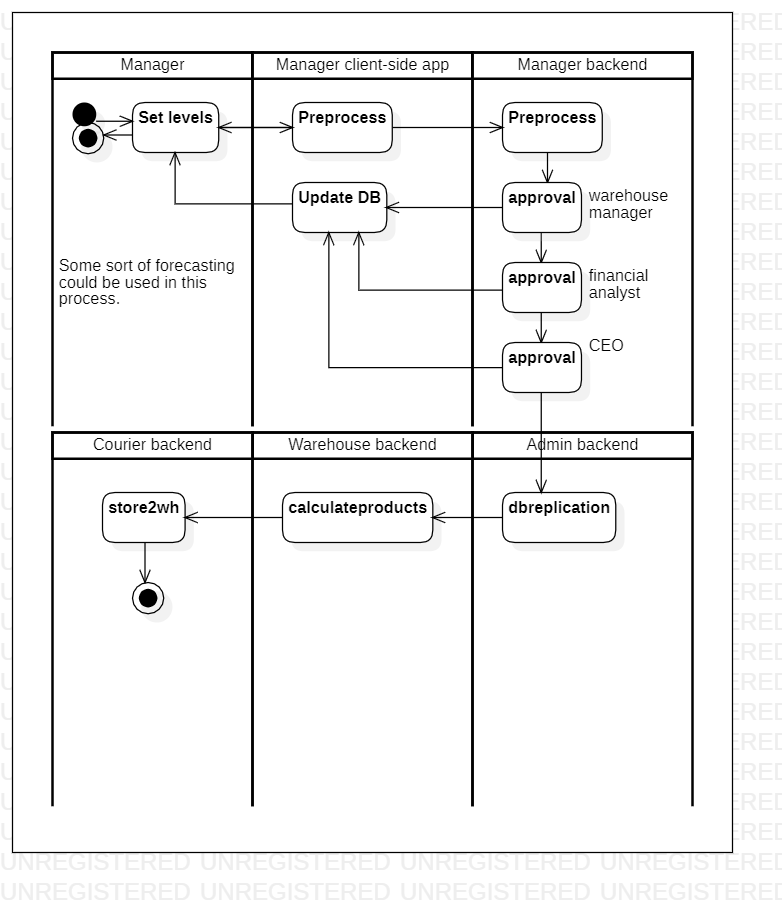

# inventorylevels

[English](inventorylevels.md) | [Русский](inventorylevels.ru.md)

Наименование: **Установить уровни запасов**.

Сценарий, отвечающий за установку уровней запасов менеджером в компании, занимающейся доставкой, включает в себя определение оптимальных уровней запасов на основе прогнозов спроса, корректировку уровней запасов по мере необходимости, чтобы избежать дефицита или избытка запасов, а также мониторинг уровней запасов для обеспечения эффективности операций.

Для данного сценария необходимо выполнения цепочки согласования (например, *руководитель склада*, *финансовый аналитик*, *генеральный директор*).

Паттерн процесса: [requesting](../../processpatterns/requesting.ru.md)

Ответственные модули: [клиентское приложение](../../frontend/managerclient.md), [бэкэнд-сервис](../../backend/managerbackend.md).

Версия платформы: v0.1

## Зависимости

### Влияет на

| Бэкэнд-сервис | Процесс |
| --- | ---- |
| [adminbackend](../../backend/adminbackend.ru.md) | [dbreplication](../admin/dbreplication.ru.md) |
| [warehousebackend](../../backend/warehousebackend.ru.md) | [calculateproducts](../warehouse/calculateproducts.ru.md) |
| [courierbackend](../../backend/courierbackend.ru.md) | [store2wh](../courier/store2wh.ru.md) |

## Описание процесса

### Пошаговое выполнение

- Менеджер открывает приложение.
- Менеджер выбирает опцию "Установить уровни инвентаря".
- Менеджер выбирает опцию установки уровней запасов.
- Приложение отображает список доступных товаров, а также текущие уровни запасов и точки повторного заказа.
- Менеджер может корректировать уровень запасов на основе прогнозов спроса или сроков поставок поставщиков.
- Система обновляет уровень запасов в базе данных.
- Приложение автоматически генерирует заказы на покупку товаров, стоимость которых ниже точки повторного заказа.
- Менеджер может просматривать и утверждать заказы на закупку перед их отправкой поставщикам.

