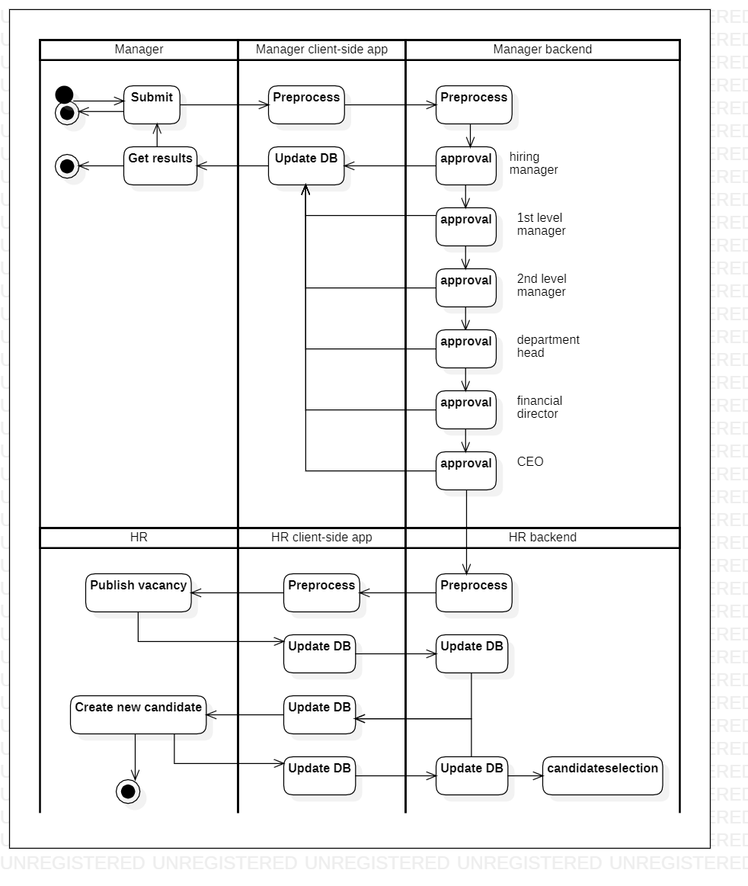

# startemployeesearch

[English](startemployeesearch.md) | [Русский](startemployeesearch.ru.md)

Name: **Start employee search**.

The scenario responsible for launching the search for employees by the manager allows you to search for employees (candidates) to work in the company according to various criteria.
This allows managers to form a database of candidates, as well as quickly find and communicate with the right candidates for hiring.

This scenario includes the following processes:
- the process of coordinating the search for an employee at the preparation stage (coordinating: hiring manager, 1st and 2nd level managers, department head, financial director, general director);
- the processes of screening, selection, hiring and onboarding are combined into one thread for each candidate (this thread is launched for each candidate, theoretically an unlimited number of threads can be launched): this solution allows you to simultaneously conduct a series of interviews for several candidates for one position, as well as Hire multiple candidates for one position and track their progress during the probationary period.

Process pattern: [organizational](../../processpatterns/organizational.md)

Responsible modules: [client application](../../frontend/managerclient.md), [backend service](../../backend/managerbackend.md).

## Process description

External services that could be used for getting information about potential candidates when searching for a new employee by manager in the delivery service company include job posting websites (e.g. Indeed, Glassdoor), recruiting agencies, and professional networking sites (e.g. LinkedIn).

Candidate screening methods: 
- Background checks,
- Resume screening,
- Cover letter screening,
- Application form,
- Video screening,
- Screening through phone calls,
- Pre-assessment tests,
- Personality tests,
- Written tests,
- Face-to-face interviews.

Full cycle recruiting: 
- Preparing (vacancy intake with hiring manager, write job description, create job advert),
- Sourcing (sourcing candidates, check existing talent pool, keep hiring manager informed),
- Screening (screen resumes, phone screening, give realistic job preivew),
- Selecting (close contact with hiring manager, use an interview guide to structure the process, automate the interview scheduling),
- Hiring (perform reference checks, do background check, support manager in making a data-driven hiring decision).

Short-listing matrix could be used in order to evaluate candidates.

The stages of the selection process: 
- Identifying hiring needs,
- Creating a recruitment plan,
- Setting up ads,
- Application,
- Screening and pre-selection,
- Interview,
- Assessment,
- References and background check,
- Decision,
- Job offer and contract,
- Onboarding.

### Step-by-step execution

- The manager opens the app for managers.
- The manager selects the option to start employee search.

- If there are multiple candidates for a position, the system notifies HR to schedule interviews with each candidate.
- After interviews are conducted, the interviewers provide feedback and ratings for each candidate.
- The manager reviews the feedback and ratings and selects the most suitable candidate for the position.
- The system notifies the chosen candidate and HR to proceed with the hiring process.

## Data structures

### Objects

- EmployeeSearch
    - EmployeeSearch object could have properties like searchCriteria, searchResults, etc. 
- [Employee](https://github.com/alexeysp11/workflow-lib/blob/main/src/Models/Business/InformationSystem/Employee.cs)
- Candidate
    - Employee object could have properties like name, ID, role, skills, etc. 
- [EmploymentContract](https://github.com/alexeysp11/workflow-lib/blob/main/src/Models/Business/BusinessDocuments/EmploymentContract.cs)

### DTOs

- EmployeeSearchDTO
    - EmployeeSearchDTO could have properties like searchCriteria, employeeName, employeeID, employeeRole, employeeSkills, etc.
