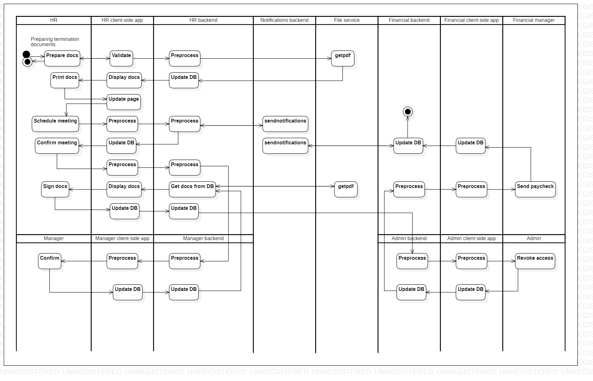

# terminationofemployment

[English](terminationofemployment.md) | [Русский](terminationofemployment.ru.md)

Наименование: **Прекращение трудоустройства**.

Сценарий увольнения, запускаемый менеджером в компании, занимающейся доставкой, предполагает использование приложения управления для инициирования процесса увольнения сотрудника, включая документирование причины увольнения и обеспечение оформления всех необходимых документов и процессов.

Паттерн процесса: [requesting](../../processpatterns/requesting.ru.md)

Ответственные модули: [клиентское приложение](../../frontend/managerclient.md), [бэкэнд-сервис](../../backend/managerbackend.md).

## Зависимости

### Влияет на

| Бэкэнд-сервис | Процесс |
| --- | ---- |
| [notificationsbackend](../../backend/notificationsbackend.ru.md) | [sendnotifications](../notificationsbackend/sendnotifications.ru.md) |
| [fileservice](../../backend/fileservice.ru.md) | [getpdf](../fileservice/getpdf.ru.md) |

## Описание процесса

### Пошаговое выполнение

- Менеджер открывает приложение на своем устройстве.
- Руководитель выбирает опцию "Расторгнуть трудовое соглашение".
- Система отображает список сотрудников и их текущий статус занятости.
- Руководитель выбирает сотрудника и указывает причину увольнения.
- Система обновляет статус сотрудника в базе данных и уведомляет HR о необходимости продолжить процесс увольнения.

