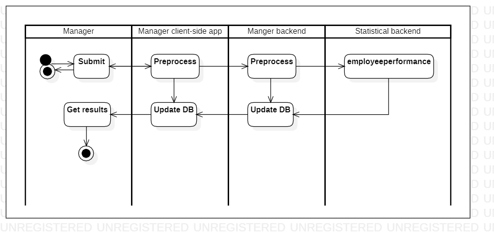

# trackperformance

[English](trackperformance.md) | [Русский](trackperformance.ru.md)

Наименование: **Отслеживать производительность**.

Сценарий, отвечающий за отслеживание производительности сотрудников и стратегий доставки менеджером компании, занимающейся доставкой, включает сбор данных о сроках доставки, удовлетворенности клиентов, производительности сотрудников и других соответствующих показателях, анализ данных для выявления тенденций и областей для улучшения, а также внедрение изменений для улучшения производительности.

Паттерн процесса: [information](../../processpatterns/information.ru.md)

Ответственные модули: [клиентское приложение](../../frontend/managerclient.md), [бэкэнд-сервис](../../backend/managerbackend.md).

## Зависимости

### Влияет на

| Бэкэнд-сервис | Процесс |
| --- | ---- |
| [statisticalbackend](../../backend/statisticalbackend.ru.md) | [employeeperformance](../statisticalbackend/employeeperformance.ru.md) |

## Описание процесса

Общую эффективность компании можно оценить, отслеживая такие показатели, как темпы роста доходов, уровень удержания клиентов и доля рынка. Показатели производительности можно использовать для планирования стратегий расширения компании путем определения областей для улучшения и постановки целей для улучшения.

### Пошаговое выполнение

- Менеджер открывает приложение службы доставки и переходит к серверной службе для менеджеров.
- Менеджер выбирает опцию просмотра показателей производительности.
- Приложение отображает в режиме реального времени данные об объеме заказов, сроках доставки и рейтингах удовлетворенности клиентов.
- Менеджер может фильтровать данные по местоположению, периоду времени или другим важным факторам.
- Приложение также предоставляет рекомендации по улучшению производительности на основе анализа данных.
- Менеджер может использовать эту информацию для принятия решений на основе данных и оптимизации бизнес-операций.

