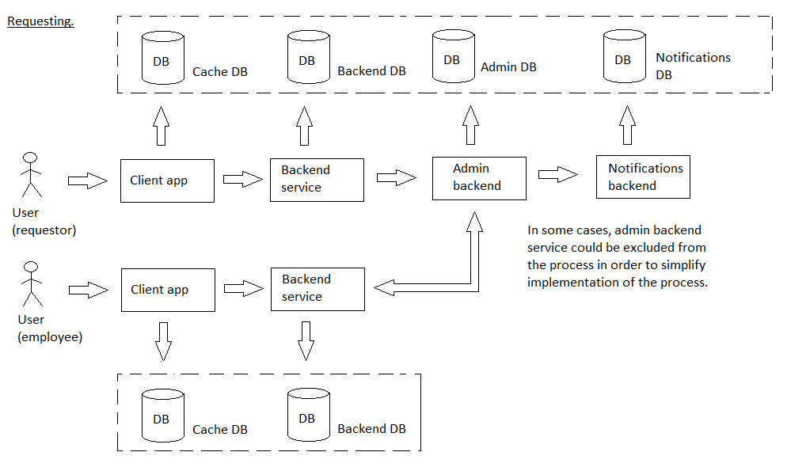

# notificationtargeting

[English](notificationtargeting.md) | [Русский](notificationtargeting.ru.md)

Name: **Notifications targeting**.

The scenario responsible for notification targeting in the delivery service company involves identifying which customers should receive a particular notification based on factors such as their location, order history, and preferences. 

Process pattern: [requesting](../../processpatterns/requesting.md)

Responsible modules: [client application](../../frontend/managerclient.md), [backend service](../../backend/managerbackend.md).

## Process description

### Step-by-step execution

- Defining the target audience segments
- Implementing user segmentation logic
- Testing the targeting functionality
- Integrating the targeting system with notification creation and scheduling
- Monitoring and analyzing the effectiveness of targeted notifications
- Iteratively optimizing the targeting criteria based on feedback and data analysis

## Data structures

### Objects 

- The customer information model could include properties such as customer name, address, and order history. 
- The notification template could include properties such as message content and formatting. 
- The targeting rules could include properties such as geographic location, order frequency, and product preferences.
