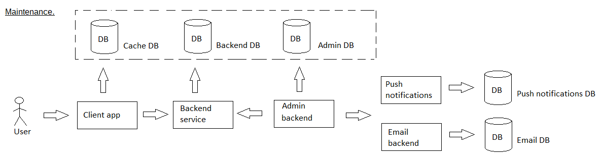
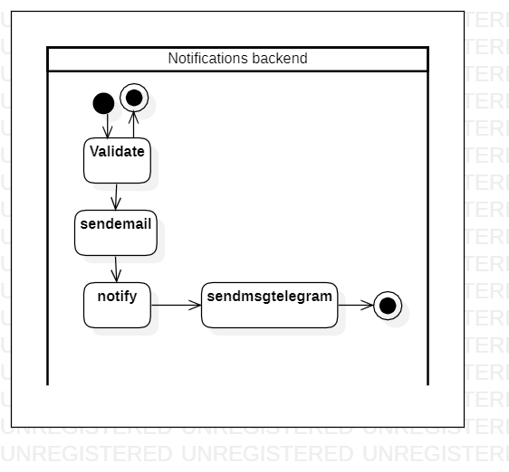

# sendnotifications

[English](sendnotifications.md) | [Русский](sendnotifications.ru.md)

Name: **Sending notifications**.

The scenario for sending notifications in the delivery service company.

The scenario responsible for sending notifications in the delivery service company involves sending notifications to customers based on factors such as their delivery status, order history, and preferences. 

Process pattern: [maintenance](../../processpatterns/maintenance.md)

Responsible modules: [backend service](../../backend/systembackend.md)

## Dependencies

### Influences on

| Backend service | Process |
| --- | ---- |
| [notificationsbackend](../../backend/notificationsbackend.md) | [sendemail](../notificationsbackend/sendemail.md) |
| [notificationsbackend](../../backend/notificationsbackend.md) | [sendpush](../notificationsbackend/sendpush.md) |
| [notificationsbackend](../../backend/notificationsbackend.md) | [sendmsgtelegram](../notificationsbackend/sendmsgtelegram.md) |

## Process description

### Step-by-step execution

- User triggers an event that requires a notification to be sent (e.g., order confirmation, delivery update)
- System identifies the notification type and content based on the event
- System retrieves the user's notification preferences and contact information
- System composes the notification message and formats it according to the user's preferences and device capabilities
- System sends the notification message to the user's preferred channel (e.g., email, push notification, SMS)
- System tracks the notification delivery status and reports any errors or issues

## Data structures

### Objects 

- The notification template could include properties such as message content and formatting. 
- The customer information model could include properties such as customer name, address, and order history. 
- The messaging service could include methods for sending messages through various channels such as email, SMS, or push notifications.

