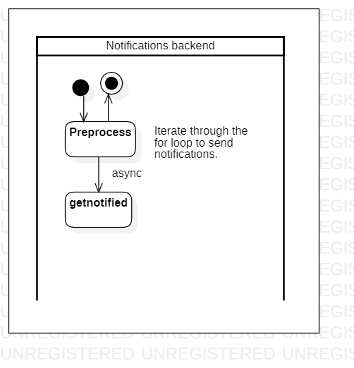

# sendpush

[English](sendpush.md) | [Русский](sendpush.ru.md)

Name: **Sending push notifications to users**.

A script responsible for notifying users using push notifications.

This scenario should not be confused with the [notifymanual](../notificationsbackend/notifymanual.ru.md) scenario, since [notifymanual](../notificationsbackend/notifymanual.ru.md) is responsible for manual notification by users within the company, while as [sendpush](../notificationsbackend/sendpush.ru.md) is used to automatically sendpush all users of the system (including customers and potential buyers).

Process pattern: [maintenance](../../processpatterns/maintenance.md)

Responsible modules: [backend service](../../backend/notificationsbackend.md)

## Dependencies

### Depends on

| Backend service | Process |
| --- | ---- |
| [notificationsbackend](../../backend/notificationsbackend.md) | [sendnotifications](../notificationsbackend/sendnotifications.md) |

### Influences on

| Backend service | Process |
| --- | ---- |
| [notificationsbackend](../../backend/notificationsbackend.md) | [getnotified](../notificationsbackend/getnotified.md) |

## Process description

### Step-by-step execution

- The backend service performs preliminary processing of the request in order to check it for errors.
- If there are no errors, a cycle is executed in which the [getnotified](../notificationsbackend/getnotified.ru.md) process is called for each system user specified in the recipient list.

