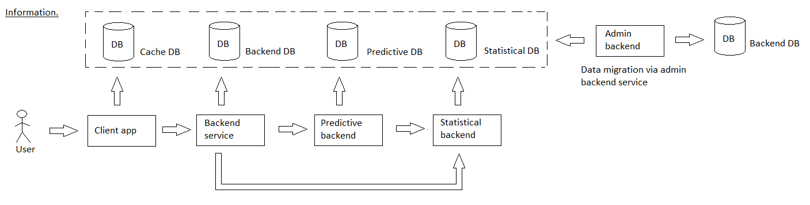

# forecastfinancial

[English](forecastfinancial.md) | [Русский](forecastfinancial.ru.md)

Name: **Forecast of the financial parameters**.

The scenario for forecasting revenue, expenses, profitability, and risks involves analyzing historical data and using statistical methods such as linear regression and decision trees to predict future financial outcomes and inform strategic business decisions.

Process pattern: [information](../../processpatterns/information.md)

Responsible modules: [backend service](../../backend/predictivebackend.md)

## Process description

### Step-by-step execution

- Run an SQL query to obtain historical sales data and financial data (data in the database appears through replication/migration from the backend service [customerbackend](../../backend/customerbackend.ru.md)).
- The following data sampling criteria may be applied:
    - by dates/months/years (to identify seasonal dependencies and forecasting);
    - by the time when the order is made (to identify the dependence of the time of day on the quantity of ordered products).
- Apply statistical methods such as linear regression and decision trees to predict future revenue, expenses, profitability, and risks
- Use insights from financial forecasting to inform strategic business decisions
