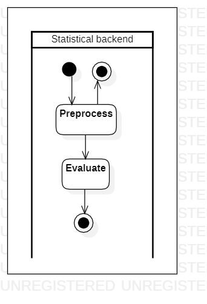

# analyzecustomerfeedback

[English](analyzecustomerfeedback.md) | [Русский](analyzecustomerfeedback.ru.md)

Наименование: **Анализ отзывов клиентов**.

Сценарий анализа отзывов клиентов включает обработку данных отзывов и использование таких методов, как анализ настроений и кластеризация, для выявления закономерностей и тенденций в уровнях удовлетворенности клиентов.

Паттерн процесса: [information](../../processpatterns/information.ru.md)

Ответственные модули: [бэкэнд-сервис](../../backend/statisticalbackend.md).

Версия платформы: v0.4

## Зависимости

### Зависит от

| Бэкэнд-сервис | Процесс |
| --- | ---- |
| [statisticalbackend](../../backend/statisticalbackend.ru.md) | [employeeperformance](../statisticalbackend/employeeperformance.ru.md) |

## Описание процесса

### Пошаговое выполнение

- На статистический бэкэнд-сервис приходит запрос, в котором указан локация и период времени.
- Применять методы анализа настроений и кластеризации для выявления закономерностей и тенденций в уровне удовлетворенности клиентов.
- Создание отчетов и визуализаций для передачи результатов анализа обратной связи.
- Внедрять изменения на основе обратной связи для повышения удовлетворенности клиентов.

