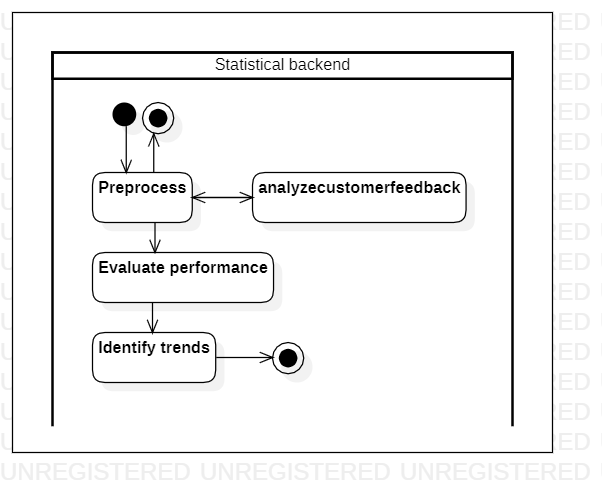

# employeeperformance

[English](employeeperformance.md) | [Русский](employeeperformance.ru.md)

Name: **Estimate employee performance**.

The scenario for estimating employee and company performance involves analyzing relevant data and using methods such as regression analysis and time series analysis to evaluate key performance indicators over a specific period of time.

Process pattern: [information](../../processpatterns/information.md)

Responsible modules: [backend service](../../backend/statisticalbackend.md)

Platform version: v0.4

## Dependencies

### Depends on

| Backend service | Process |
| --- | ---- |
| [managerbackend](../../backend/managerbackend.md) | [trackperformance](../manager/trackperformance.md) |

### Influences on

| Backend service | Process |
| --- | ---- |
| [statisticalbackend](../../backend/statisticalbackend.md) | [analyzecustomerfeedback](../statisticalbackend/analyzecustomerfeedback.md) |

## Process description

Metrics that could be used by managers in the delivery service company to measure performance include:
- Kitchen: order accuracy rate, order preparation time, customer feedback ratings
- Warehouse: inventory accuracy rate, order fulfillment time, product return rate
- Couriers: delivery completion rate, delivery time, customer feedback ratings
- Managers: employee retention rate, team productivity, customer satisfaction ratings
- Admins: system uptime, response time to support requests, data accuracy rate

### Step-by-step execution

- A request is received to the statistical backend service, which contains a list of employees for whom efficiency calculations need to be made.
- Depending on the department in which the employee works, the calculation of his effectiveness is implemented in different ways, i.e. based on different metrics.
- Apply regression analysis and time series analysis methods to evaluate key performance indicators over a specific period of time
- Identify trends and patterns in performance data
- Use insights from data analysis to make informed decisions for performance improvement

